# Lantern Analysis Plan

Confidence Score: 1.00

## Dependency Graph

```mermaid
graph TD
    src_lantern_cli_backends_openai_py[src/lantern_cli/backends/openai.py] --> src_lantern_cli_backends_base_py[src/lantern_cli/backends/base.py]
    src_lantern_cli_backends_claude_py[src/lantern_cli/backends/claude.py] --> src_lantern_cli_backends_base_py[src/lantern_cli/backends/base.py]
    src_lantern_cli_backends_factory_py[src/lantern_cli/backends/factory.py] --> src_lantern_cli_backends_base_py[src/lantern_cli/backends/base.py]
    src_lantern_cli_backends_factory_py[src/lantern_cli/backends/factory.py] --> src_lantern_cli_backends_claude_py[src/lantern_cli/backends/claude.py]
    src_lantern_cli_backends_factory_py[src/lantern_cli/backends/factory.py] --> src_lantern_cli_backends_codex_py[src/lantern_cli/backends/codex.py]
    src_lantern_cli_backends_factory_py[src/lantern_cli/backends/factory.py] --> src_lantern_cli_backends_gemini_py[src/lantern_cli/backends/gemini.py]
    src_lantern_cli_backends_factory_py[src/lantern_cli/backends/factory.py] --> src_lantern_cli_backends_openai_py[src/lantern_cli/backends/openai.py]
    src_lantern_cli_backends_codex_py[src/lantern_cli/backends/codex.py] --> src_lantern_cli_backends_base_py[src/lantern_cli/backends/base.py]
    src_lantern_cli_backends_gemini_py[src/lantern_cli/backends/gemini.py] --> src_lantern_cli_backends_base_py[src/lantern_cli/backends/base.py]
    src_lantern_cli_core_runner_py[src/lantern_cli/core/runner.py] --> src_lantern_cli_core_architect_py[src/lantern_cli/core/architect.py]
    src_lantern_cli_core_runner_py[src/lantern_cli/core/runner.py] --> src_lantern_cli_backends_base_py[src/lantern_cli/backends/base.py]
    src_lantern_cli_core_runner_py[src/lantern_cli/core/runner.py] --> src_lantern_cli_core_state_manager_py[src/lantern_cli/core/state_manager.py]
    src_lantern_cli_core_state_manager_py[src/lantern_cli/core/state_manager.py] --> src_lantern_cli_core_architect_py[src/lantern_cli/core/architect.py]
    src_lantern_cli_core_architect_py[src/lantern_cli/core/architect.py] --> src_lantern_cli_static_analysis_dependency_graph_py[src/lantern_cli/static_analysis/dependency_graph.py]
    src_lantern_cli_cli_main_py[src/lantern_cli/cli/main.py] --> src_lantern_cli_config_loader_py[src/lantern_cli/config/loader.py]
    src_lantern_cli_cli_main_py[src/lantern_cli/cli/main.py] --> src_lantern_cli_core_runner_py[src/lantern_cli/core/runner.py]
    src_lantern_cli_cli_main_py[src/lantern_cli/cli/main.py] --> src_lantern_cli_static_analysis_dependency_graph_py[src/lantern_cli/static_analysis/dependency_graph.py]
    src_lantern_cli_cli_main_py[src/lantern_cli/cli/main.py] --> src_lantern_cli_core_state_manager_py[src/lantern_cli/core/state_manager.py]
    src_lantern_cli_cli_main_py[src/lantern_cli/cli/main.py] --> src_lantern_cli_core_architect_py[src/lantern_cli/core/architect.py]
    src_lantern_cli_cli_main_py[src/lantern_cli/cli/main.py] --> src_lantern_cli_backends_factory_py[src/lantern_cli/backends/factory.py]
    src_lantern_cli_cli_main_py[src/lantern_cli/cli/main.py] --> src_lantern_cli_core_synthesizer_py[src/lantern_cli/core/synthesizer.py]
    src_lantern_cli_config_loader_py[src/lantern_cli/config/loader.py] --> src_lantern_cli_config_models_py[src/lantern_cli/config/models.py]
    src_lantern_cli_static_analysis_file_filter_py[src/lantern_cli/static_analysis/file_filter.py] --> src_lantern_cli_config_models_py[src/lantern_cli/config/models.py]
    src_lantern_cli_static_analysis_dependency_graph_py[src/lantern_cli/static_analysis/dependency_graph.py] --> src_lantern_cli_static_analysis_python_py[src/lantern_cli/static_analysis/python.py]
```

## Phase 1

### Learning Objectives
- Understand the role of 5 module(s) in Layer 0
- Identify key data structures and interfaces

### Execution Batches
- [ ] Batch 1: `src/lantern_cli/backends/base.py, src/lantern_cli/config/models.py, src/lantern_cli/core/synthesizer.py`
- [ ] Batch 2: `src/lantern_cli/static_analysis/generic.py, src/lantern_cli/static_analysis/python.py`

## Phase 2

### Learning Objectives
- Understand the role of 7 module(s) in Layer 1
- Identify key data structures and interfaces

### Execution Batches
- [ ] Batch 3: `src/lantern_cli/backends/claude.py, src/lantern_cli/backends/codex.py, src/lantern_cli/backends/gemini.py`
- [ ] Batch 4: `src/lantern_cli/backends/openai.py, src/lantern_cli/config/loader.py, src/lantern_cli/static_analysis/dependency_graph.py`
- [ ] Batch 5: `src/lantern_cli/static_analysis/file_filter.py`

## Phase 3

### Learning Objectives
- Understand the role of 2 module(s) in Layer 2
- Identify key data structures and interfaces

### Execution Batches
- [ ] Batch 6: `src/lantern_cli/backends/factory.py, src/lantern_cli/core/architect.py`

## Phase 4

### Learning Objectives
- Understand the role of 1 module(s) in Layer 3
- Identify key data structures and interfaces

### Execution Batches
- [ ] Batch 7: `src/lantern_cli/core/state_manager.py`

## Phase 5

### Learning Objectives
- Understand the role of 1 module(s) in Layer 4
- Identify key data structures and interfaces

### Execution Batches
- [ ] Batch 8: `src/lantern_cli/core/runner.py`

## Phase 6

### Learning Objectives
- Understand the role of 1 module(s) in Layer 5
- Identify key data structures and interfaces

### Execution Batches
- [ ] Batch 9: `src/lantern_cli/cli/main.py`
