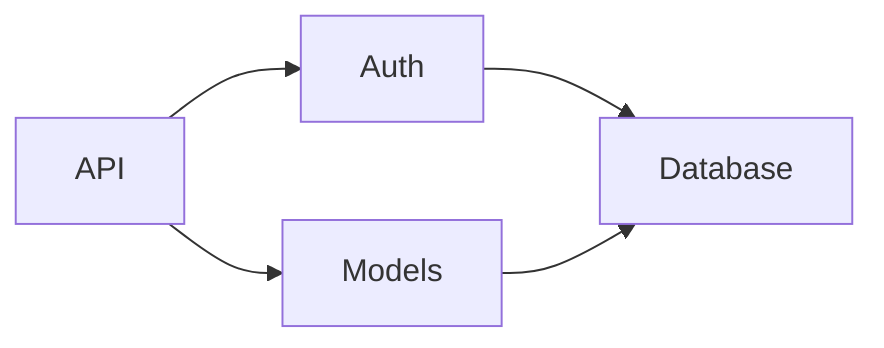
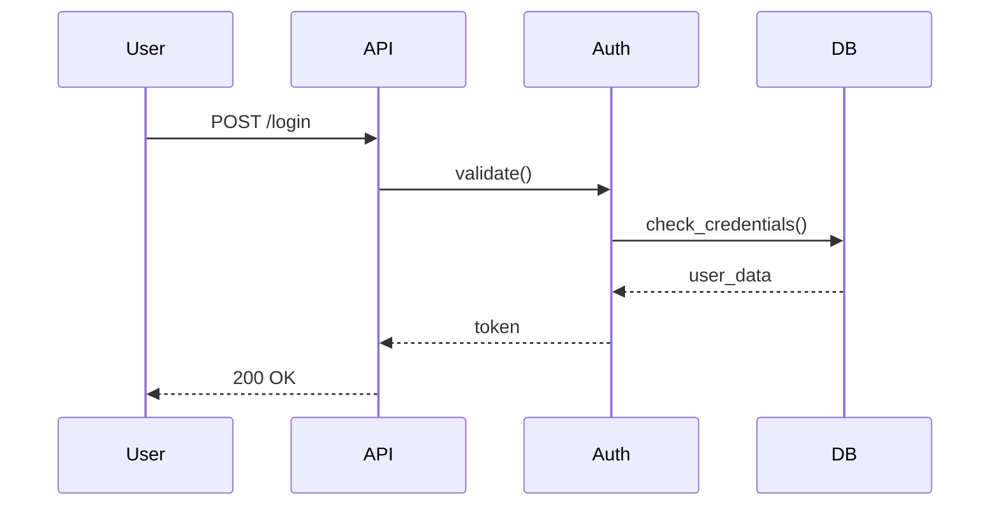

# Lantern

> **Lighting your way through the code forest.**

[English] | [繁體中文](README_zh-TW.md)


**Lantern is your CLI mentor that turns complex repositories into a step-by-step narrative.**

Understand codebases faster with AI-guided architecture scans, planned learning paths, and human-readable guides.

**Speaks Your Language**: Complex logic is hard enough. Lantern explains code in your native language (Chinese, Japanese, Spanish, etc.) while keeping technical terms precise.

### ✨ Highlights

| | |
| :--- | :--- |
| 🧠 **Cognitive Load Reduction** | Psychology-based chunking (Miller's Law) breaks analysis into digestible batches |
| 🌐 **Native Language Output** | Technical docs in your mother tongue—Chinese, Japanese, Spanish, and more |
| 📊 **Auto-Generated Diagrams** | Mermaid flowcharts + sequence diagrams automatically created for every module |
| 💡 **Concept Extraction** | Key mental models: authentication flow, caching strategy, retry mechanisms |
| 💰 **Cost Transparency** | Pre-execution cost estimates with real-time token tracking |
| 🔄 **Checkpoint Resume** | Restart failed analyses without losing progress—production-grade reliability |
| 🔒 **Local & Private** | Supports Ollama for 100% local analysis—safe for enterprise codebases |

---

# Why Lantern exists

Understanding a new codebase is hard.

You usually face:
* Not knowing which file to start with.
* Outdated or non-existent documentation.
* Hidden architectural dependencies.
* Needing to read dozens of files to understand one concept.

**The AI Code Problem**

In 2024+, codebases are increasingly filled with AI-generated code that:
* Works, but nobody fully understands *why*
* Lacks meaningful comments or documentation
* Makes legacy code comprehension even harder

Most AI tools help you:
* Write code.
* Refactor code.

**Lantern's goal is different:**
> Lantern helps you **understand** code—whether written by humans or AI.

---

# Use Cases

| Scenario | How Lantern Helps |
| :--- | :--- |
| 👤 **New Hire Onboarding** | Rapidly understand complex legacy systems without tribal knowledge |
| 🔧 **Pre-Refactoring Analysis** | Assess impact scope before making changes |
| ⚠️ **Technical Debt Assessment** | Identify high-risk modules and hidden dependencies |
| 🏗️ **Architecture Decision Support** | Make better design choices with clear system visibility |
| 🔍 **Code Review Preparation** | Understand unfamiliar code before reviewing PRs |

---

# Key Features

### 🧠 Psychology-Driven Design
Not just documentation—**designed for human comprehension**. Chunking, scaffolding, and native language output reduce cognitive load.

### 🔄 Dual-Perspective Analysis
**Bottom-up** (file-by-file details) + **Top-down** (architecture overview) = complete understanding from any angle.

### 🔌 Flexible Backends
Choose between local privacy (Ollama) or cloud power (OpenRouter). Swap backends without changing your workflow.

### ✏️ Human-in-the-Loop
Review and edit `lantern_plan.md` before execution. You control what gets analyzed and how.


# What Lantern Does

**One command. Full documentation.**

```bash
lantern run
```

Lantern analyzes your repository and generates a **complete documentation repository**:


### Input
```
path to repo
```

### Output
```
.lantern/output/
├── en/
│   ├── top_down/                    # 📖 High-level guides
│   │   ├── OVERVIEW.md             # Project vision & scope
│   │   ├── ARCHITECTURE.md         # System design + Mermaid dependency graphs
│   │   ├── CONCEPTS.md             # Key concepts (auth flow, caching, retry)
│   │   └── GETTING_STARTED.md      # Onboarding guide + Mermaid sequence diagrams
│   │
│   └── bottom_up/                   # 📝 File-by-file analysis
│       └── src/                     # Mirrors your repo structure
│           ├── kernel/
│           │   ├── scheduler.py.md  # Detailed breakdown
│           │   └── events.py.md
│           └── api/
│               └── routes.py.md
│
└── zh-TW/                           # 🌐 Native language version
    └── (same structure)
```

### How It Maintains Quality

Internally, Lantern uses **batch-based analysis** for quality control:
- Files are analyzed in small batches (1-3 related files)
- Each batch builds on context from previous batches
- This ensures **traceability** and **consistent reasoning**

You don't need to manage this—just run `lantern run` and let it work.

---

# Visual Flow Reconstruction

Lantern automatically generates **Mermaid diagrams** for every analyzed file, embedded in both bottom-up and top-down documentation:

### Architecture Diagrams
Show module dependencies and relationships in `ARCHITECTURE.md`:



### Sequence Diagrams
Illustrate request/response flows in `GETTING_STARTED.md`:



### Per-File Flow Diagrams
Each file's documentation includes a custom flow diagram showing its internal logic.

**No manual diagramming needed**—Lantern's AI analyzes code structure and generates these automatically.

---

# Key Ideas

Lantern is built on psychological design principles:

### Chunking (Miller's Law)
We strictly limit each analysis batch to ~3 related files to prevent cognitive information overload.

### Scaffolding
By generating a plan first and allowing for human review, we build a steady ladder for understanding complex systems.

### Human-First Output
Final outputs are designed for human reading, not machine consumption, focusing on "Why" and "How" rather than just "What".

---

# Quick Start

## Prerequisites

Lantern supports two backend options:

### Option A: Local Model (Free, Private)

Install [Ollama](https://ollama.ai) and pull a model:

```bash
# Install Ollama (see https://ollama.ai for your platform)
# Then pull a recommended model:
ollama pull qwen2.5:14b
```

**Best for**: Offline work, sensitive codebases, zero API costs

### Option B: Cloud API (Best Quality)

Get an [OpenRouter API key](https://openrouter.ai/keys) and set it:

```bash
export OPENROUTER_API_KEY="your-key-here"
```

**Best for**: Latest models (GPT-4, Claude Sonnet), highest quality output

| Backend | Cost | Privacy | Quality | Speed |
| :--- | :--- | :--- | :--- | :--- |
| **Ollama** | Free | 100% Local | Good | Medium |
| **OpenRouter** | Pay-per-token | Cloud API | Excellent | Fast |

## Installation

```bash
pip install lantern-cli
```

## Simple Mode (Recommended)

```bash
# Run in current directory (outputs to .lantern/)
lantern run

# Specify input and output
lantern run --repo ~/projects/my-app --output ~/docs/my-app-docs

# Use specific language
lantern run --lang zh-TW  # Traditional Chinese
```

Lantern will show you a **cost estimate** before starting. The default backend is OpenRouter, but you can configure it in `.lantern/lantern.toml`:

```toml
[backend]
type = "ollama"              # or "openrouter"
ollama_model = "qwen2.5:14b"
# openrouter_model = "openai/gpt-4o"
```

## Advanced Mode

For reviewing the analysis plan before execution:

```bash
# Step 1: Initialize
lantern init --repo /path/to/repo

# Step 2: Generate plan (review lantern_plan.md)
lantern plan

# Step 3: Execute analysis
lantern run
```

---

# Real Example

Analyzing [accellera-official/systemc](https://github.com/accellera-official/systemc):

**Top-down output** (`ARCHITECTURE.md`):
> SystemC is effectively a **co-operative multitasking OS** specialized for hardware simulation.
> At its core lies the `sc_simcontext`, which acts as the kernel, scheduler, and event manager.

**Bottom-up output** (`sc_simcontext.md`):
> `sc_simcontext` is the **central nervous system** of the SystemC simulation kernel.
> It manages: Global Simulation State, Object Registry, Scheduler, Process Management.

---

# Example: Lantern Analyzes Itself

[Click here to see the architecture report generated by Lantern analyzing its own codebase](.lantern/output/en)

---

# Configuration

## Language settings

You can set your preferred output language (e.g., Traditional Chinese, Japanese) to lower the cognitive barrier even further.

**Option A: Command line**
```bash
lantern run --lang zh-TW
```

---

# Backend Configuration

Lantern supports multiple LLM backends with easy configuration:

### Ollama (Local Models)
```toml
# .lantern/lantern.toml
[backend]
type = "ollama"
ollama_model = "qwen2.5:14b"  # or llama3, mistral, etc.
```

### OpenRouter (Cloud API)
```toml
[backend]
type = "openrouter"
openrouter_model = "openai/gpt-4o"  # or anthropic/claude-sonnet-4, etc.
```

Set your API key:
```bash
export OPENROUTER_API_KEY="sk-or-v1-..."
```

### Cost Estimation
Before execution, Lantern fetches **real-time pricing** and shows you:
- Estimated input/output tokens
- Projected cost (USD)
- Confirmation prompt

Local models (Ollama) show $0.00 cost.

---

# Roadmap

- [ ] **Execution Trace Mode**: Collect call graphs via unit tests for dynamic analysis.
- [ ] **Memory Cross-talk**: Enhanced reasoning across batch boundaries.
- [ ] **Multi-language Static Analysis**: Go, Rust, and Java support.
- [ ] **VSCode Extension**: Integrated progress tracking.

---

# Contributing

PRs are welcome! Help us build the ultimate tool for code understanding.

---

# License

MIT
