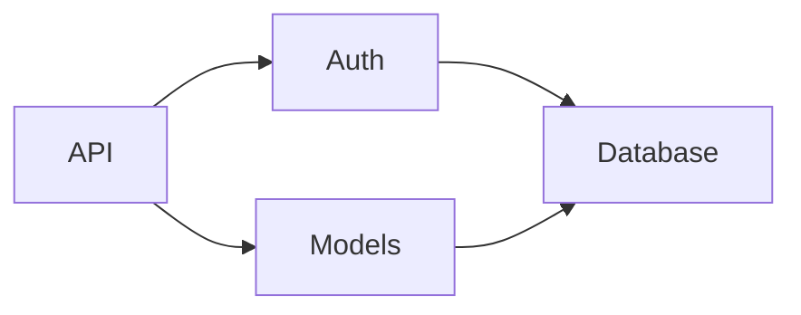

# Lantern

> **Lighting your way through the code forest.**

[English] | [繁體中文](README_zh-TW.md)


**Lantern is your CLI mentor that turns complex repositories into a step-by-step narrative.**

Understand codebases faster with AI-guided architecture scans, planned learning paths, and human-readable guides.

**Speaks Your Language**: Complex logic is hard enough. Lantern explains code in your native language (Chinese, Japanese, Spanish, etc.) while keeping technical terms precise.

### ✨ Highlights

| | |
| :--- | :--- |
| 🧠 **Cognitive Load Reduction** | Psychology-based chunking (Miller's Law) breaks analysis into digestible batches |
| 🌐 **Native Language Output** | Technical docs in your mother tongue—Chinese, Japanese, Spanish, and more |
| 📊 **Auto-Generated Diagrams** | Mermaid flowcharts + sequence diagrams automatically created for every module |
| 💡 **Concept Extraction** | Key mental models: authentication flow, caching strategy, retry mechanisms |
|  **Local & Private** | Supports Ollama for 100% local analysis—safe for enterprise codebases |

---

# Why Lantern exists

Understanding a new codebase is hard. You face:
* Not knowing which file to start with
* Outdated or missing documentation
* Hidden architectural dependencies
* Needing to read dozens of files to understand one concept

**Modern codebases often contain AI-generated code that works but lacks documentation**—making comprehension even harder.

Most AI tools help you *write* or *refactor* code. **Lantern's goal is different:**
> Lantern helps you **understand** code—whether written by humans or AI.

---

# Use Cases

| Scenario | How Lantern Helps |
| :--- | :--- |
| 👤 **New Hire Onboarding** | Rapidly understand complex legacy systems without tribal knowledge |
| 🔧 **Pre-Refactoring Analysis** | Assess impact scope before making changes |
| ⚠️ **Technical Debt Assessment** | Identify high-risk modules and hidden dependencies |
| 🏗️ **Architecture Decision Support** | Make better design choices with clear system visibility |
| 🔍 **Code Review Preparation** | Understand unfamiliar code before reviewing PRs |

---

# Core Design & Features

### 🧠 Psychology-Driven Design
**Designed for human comprehension**, not machines. Lantern uses psychological principles:
- **Chunking** (Miller's Law): Analyzes batches of ~3 related files to prevent cognitive overload
- **Scaffolding**: Generates a plan first for human review, building understanding step-by-step
- **Human-First Output**: Explains "Why" and "How", focusing on comprehension over data

### 🔄 Dual-Perspective Analysis
**Bottom-up** (file-by-file details) + **Top-down** (architecture overview) = complete understanding from any angle.

### 🔌 Flexible Backends
Choose between local privacy (Ollama), cloud power (OpenRouter/OpenAI), or agent-based workflows (CLI tools). Lantern automatically detects backend type and uses the appropriate analysis workflow.

### ✏️ Human-in-the-Loop
Review and edit `lantern_plan.md` before execution. You control what gets analyzed and how.


# What Lantern Does

**One command. Full documentation.**

```bash
lantern run
```

Lantern analyzes your repository and generates a **complete documentation repository**:


### Input
```
path to repo
```

### Output
```
.lantern/output/
├── en/
│   ├── top_down/                    # 📖 High-level guides
│   │   ├── OVERVIEW.md             # Project vision & scope
│   │   ├── ARCHITECTURE.md         # System design + Mermaid dependency graphs
│   │   ├── CONCEPTS.md             # Key concepts (auth flow, caching, retry)
│   │   └── GETTING_STARTED.md      # Onboarding guide + Mermaid sequence diagrams
│   │
│   └── bottom_up/                   # 📝 File-by-file analysis
│       └── src/                     # Mirrors your repo structure
│           ├── kernel/
│           │   ├── scheduler.py.md  # Detailed breakdown
│           │   └── events.py.md
│           └── api/
│               └── routes.py.md
│
└── zh-TW/                           # 🌐 Native language version
    └── (same structure)
```

### How It Maintains Quality

Internally, Lantern uses **batch-based analysis** for quality control:
- Files are analyzed in small batches (1-3 related files)
- Each batch builds on context from previous batches
- This ensures **traceability** and **consistent reasoning**

You don't need to manage this—just run `lantern run` and let it work.

---

# Visual Flow Reconstruction

Lantern automatically generates **Mermaid diagrams** for every analyzed file:

### Architecture Diagrams
Show module dependencies in `ARCHITECTURE.md`:



**Sequence Diagrams & Per-File Flows**: Lantern also generates request/response sequence diagrams and per-file flow diagrams showing internal logic.

**No manual work needed**—diagrams are generated automatically by analyzing your code structure.

---

# Quick Start

## Prerequisites

Lantern supports multiple backend options. See [Backend Configuration](#backend-configuration) for detailed setup instructions:

- **OpenAI** (Recommended) - Cost-effective, production-ready
- **Ollama** (Free & Private) - Run locally without API calls
- **OpenRouter** - Access multiple providers (Claude, Gemini, etc.)
- **CLI Tool** - Leverage agent capabilities (file tools, code execution)

## Installation

```bash
pip install repo-lantern
```

## Simple Mode (Recommended)

```bash
# Run in current directory (outputs to .lantern/)
lantern run

# Specify input and output
lantern run --repo ~/projects/my-app --output ~/docs/my-app-docs

# Use specific language
lantern run --lang zh-TW  # Traditional Chinese
```

Lantern will show you a **cost estimate** before starting. The default backend is OpenAI, but you can configure it in `.lantern/lantern.toml`:

```toml
[backend]
type = "openai"              # or "ollama", "openrouter"
openai_model = "gpt-4o-mini" # fast and cheap for production
# openai_model = "gpt-4o"    # higher quality option
```

## Advanced Mode

For reviewing the analysis plan before execution:

```bash
# Step 1: Initialize
lantern init --repo /path/to/repo

# Step 2: Generate plan (review lantern_plan.md)
lantern plan

# Step 3: Execute analysis
lantern run
```

# Configuration

## Language settings

You can set your preferred output language (e.g., Traditional Chinese, Japanese) to lower the cognitive barrier even further.

**Option A: Command line**
```bash
lantern run --lang zh-TW
```

---

# Backend Configuration

Lantern supports multiple LLM backends with easy configuration:

### OpenAI (Recommended for Production) ⭐
```toml
# .lantern/lantern.toml
[backend]
type = "openai"
openai_model = "gpt-4o-mini"  # Fast and cheap
# openai_model = "gpt-4o"     # Higher quality
```

Set your API key:
```bash
export OPENAI_API_KEY="sk-..."
```

**Pricing** (as of 2025):
- gpt-4o-mini: $0.15/1M input, $0.60/1M output
- gpt-4o: $2.50/1M input, $10/1M output

### Ollama (Local Models)
```toml
[backend]
type = "ollama"
ollama_model = "qwen2.5:14b"  # or llama3, mistral, etc.
```

### OpenRouter (Multi-Model Access)
```toml
[backend]
type = "openrouter"
openrouter_model = "openai/gpt-4o-mini"  # or anthropic/claude-sonnet-4, etc.
```

Set your API key:
```bash
export OPENROUTER_API_KEY="sk-or-v1-..."
```

### CLI Tool (Agent-Based Workflow) 🤖
```toml
[backend]
type = "cli"
cli_command = "codex exec"  # or "llm -m gpt-4o-mini", "claude", etc.
cli_model_name = "cli"
```

**How it works**:
- Lantern detects CLI backends and automatically switches to **agent-based workflow**
- Prompts instruct the agent to write Markdown files directly using file tools
- Agents leverage their native capabilities (code execution, file operations, etc.)
- No JSON parsing required - agents write documentation files directly

**Supported CLI tools**:
- `codex exec` - OpenAI Codex with agent capabilities
- `llm -m <model>` - Simon Willison's LLM tool
- `claude` - Anthropic Claude CLI
- Any custom CLI that accepts stdin and outputs to stdout

**Example workflow**:
```bash
# Install a CLI tool (example: llm)
pip install llm

# Configure Lantern to use it
echo '[backend]
type = "cli"
cli_command = "llm -m gpt-4o-mini"
cli_model_name = "gpt-4o-mini"' > .lantern/lantern.toml

# Run analysis
lantern run
```

### Cost Estimation
Before execution, Lantern fetches **real-time pricing** and shows you:
- Estimated input/output tokens
- Projected cost (USD)
- Confirmation prompt

Local models (Ollama) show $0.00 cost.

---

# Roadmap

- [ ] **Execution Trace Mode**: Collect call graphs via unit tests for dynamic analysis.
- [ ] **Memory Cross-talk**: Enhanced reasoning across batch boundaries.
- [ ] **Multi-language Static Analysis**: Go, Rust, and Java support.
- [ ] **VSCode Extension**: Integrated progress tracking.

---

# Contributing

PRs are welcome! Help us build the ultimate tool for code understanding.

---

# License

MIT
