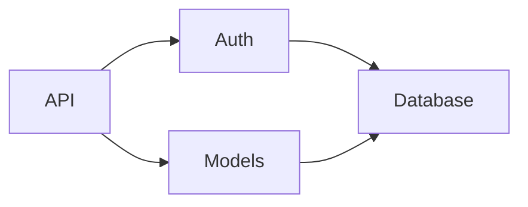

# Lantern

> **在黑暗的程式碼森林中，照亮你的方向。**

[English](README.md) | [繁體中文]


**Lantern 是你的 CLI 導師，將複雜的 Repository 轉化為循序漸進的敘事流程。**

透過 AI 引導的架構掃描、規劃好的學習路徑以及人類可讀的指南，更快速地理解程式碼庫。

**說你的語言**：邏輯已經夠複雜了。Lantern 使用你的母語（中文、日文、西班牙文等）解釋程式碼，同時保持技術術語的精確性。

### ✨ 亮點

| | |
| :--- | :--- |
| 🧠 **認知負擔減輕** | 基於心理學的區塊化設計（米勒定律），將分析拆解為可消化的小批次 |
| 🌐 **母語輸出** | 技術文檔以你的母語呈現——中文、日文、西班牙文等 |
| 📊 **自動生成圖表** | 為每個模組自動生成 Mermaid 流程圖 + Sequence Diagram |
| 💡 **概念萃取** | 核心認知模型：認證流程、快取策略、重試機制 |
| 🔒 **本地優先、隱私可控** | 支援 Ollama 100% 本地分析——適合企業與敏感程式碼庫 |

---

# 為什麼需要 Lantern

理解一個陌生的程式碼庫非常困難。你通常會遇到：
* 不知道該從哪個檔案開始看起
* 文件過時或根本不存在
* 隱藏的系統架構依賴關係
* 需要閱讀數十個檔案才能理解一個核心概念

**現代程式碼庫中常有 AI 生成的程式碼能運作卻缺乏文檔**——使理解更困難。

大多數 AI 工具幫助你*寫*或*重構*程式碼。**Lantern 的目標截然不同：**
> Lantern 幫助你「理解」程式碼——無論是人寫的還是 AI 生成的。

---

# 應用場景 (Use Cases)

| 場景 | Lantern 如何幫助 |
| :--- | :--- |
| 👤 **新人 Onboarding** | 快速理解複雜遺留系統，無需依賴「部落知識」 |
| 🔧 **重構前分析** | 評估修改影響範圍，降低風險 |
| ⚠️ **技術債務評估** | 識別高風險模組與隱藏依賴 |
| 🏗️ **架構決策輔助** | 透過清晰的系統視野做出更好的設計選擇 |
| 🔍 **Code Review 準備** | 在審查 PR 前先理解陌生程式碼 |

---

# 設計原則與核心特色

### 🧠 心理學導向設計
**專為人類理解而設計**，採用心理學原則：
- **區塊化**（米勒定律）：每個分析批次限制在約 3 個相關檔案，防止認知超載
- **鷹架效應**（Scaffolding）：先生成計畫供人工審查，循序漸進地建立理解
- **人類優先輸出**：解釋「為什麼」與「如何運作」，優先考量人類閱讀體驗

### 🔄 雙向分析視角
**Bottom-up**（逐檔細節）+ **Top-down**（架構總覽）= 從任何角度完整理解。

### 🔌 彈性後端
可選擇本地隱私（Ollama）或雲端效能（OpenRouter）。更換後端無需改變工作流程。

### ✏️ 人機協作
在執行前審查並編輯 `lantern_plan.md`。你掌控分析的內容與方式。

# Lantern 的功能

**一次指令。完整文檔。**

```bash
lantern run
```

Lantern 分析你的 Repository 並產生一個 **完整的文檔庫**：


### 輸入
```
path to repo
```

### 輸出
```
.lantern/output/
├── en/
│   ├── top_down/                    # 📖 高層次指南
│   │   ├── OVERVIEW.md             # 專案願景與範圍
│   │   ├── ARCHITECTURE.md         # 系統設計 + Mermaid 依賴圖
│   │   ├── CONCEPTS.md             # 核心概念（認證流程、快取、重試）
│   │   └── GETTING_STARTED.md      # 新手上手指南 + Mermaid Sequence Diagram
│   │
│   └── bottom_up/                   # 📝 逐檔分析
│       └── src/                     # 鏡像你的 repo 結構
│           ├── kernel/
│           │   ├── scheduler.py.md  # 詳細拆解
│           │   └── events.py.md
│           └── api/
│               └── routes.py.md
│
└── zh-TW/                           # 🌐 母語版本
    └── (同上結構)
```

### 如何確保品質

Lantern 內部使用 **批次分析** 來控制品質：
- 檔案以小批次分析（1-3 個相關檔案）
- 每個批次建立在前一批次的脈絡之上
- 確保 **可追溯性** 與 **一致的推理**

你不需要管理這些——只要執行 `lantern run` 讓它運作。

---

# 視覺化流程重建

Lantern 會自動為每個分析的檔案生成 **Mermaid 圖表**：

### 架構圖
在 `ARCHITECTURE.md` 中顯示模組依賴與關係：



**Sequence Diagram 與逐檔流程圖**：Lantern 也會生成請求/回應的 Sequence Diagram 與顯示內部邏輯的逐檔流程圖。

**無需手動工作**——圖表透過分析程式碼結構自動生成。

---

# 快速上手

## 前置需求

Lantern 支援多種後端選項。詳細設定說明請見[後端設定](#後端設定)：

- **OpenAI**（推薦）- 成本效益高、適合生產環境
- **Ollama**（免費且隱私）- 在本地執行，無 API 呼叫
- **OpenRouter** - 存取多個提供商（Claude、Gemini 等）
- **CLI Tool** - 利用代理能力（檔案工具、程式碼執行）

## 安裝

```bash
pip install repo-lantern
```

## 簡易模式（推薦）

```bash
# 在當前目錄執行（輸出至 .lantern/）
lantern run

# 指定輸入與輸出
lantern run --repo ~/projects/my-app --output ~/docs/my-app-docs

# 使用特定語言
lantern run --lang zh-TW  # 繁體中文
```

Lantern 會在開始前顯示**成本估算**。預設後端為 OpenAI，但你可以在 `.lantern/lantern.toml` 中設定：

```toml
[backend]
type = "openai"              # 或 "ollama"、"openrouter"
openai_model = "gpt-4o-mini" # 生產環境快速且便宜
# openai_model = "gpt-4o"    # 更高品質選項
```

## 進階模式

若需要審查分析計畫：

```bash
# Step 1: 初始化
lantern init --repo /path/to/repo

# Step 2: 生成計畫（審查 lantern_plan.md）
lantern plan

# Step 3: 執行分析
lantern run
```

# 設定

## 語言設定

你可以設定偏好的輸出語言（如繁體中文、日文），進一步降低認知門檻。

**方法 A：命令列參數**
```bash
lantern run --lang zh-TW
```

---

# 後端設定

Lantern 支援多種 LLM 後端，設定簡單：

### OpenAI（生產環境推薦）⭐
```toml
# .lantern/lantern.toml
[backend]
type = "openai"
openai_model = "gpt-4o-mini"  # 快速且便宜
# openai_model = "gpt-4o"     # 更高品質
```

設定你的 API 金鑰：
```bash
export OPENAI_API_KEY="sk-..."
```

**定價**（2025 年）：
- gpt-4o-mini：$0.15/1M 輸入，$0.60/1M 輸出
- gpt-4o：$2.50/1M 輸入，$10/1M 輸出

### Ollama（本地模型）
```toml
[backend]
type = "ollama"
ollama_model = "qwen2.5:14b"  # 或 llama3、mistral 等
```

### OpenRouter（多模型存取）
```toml
[backend]
type = "openrouter"
openrouter_model = "openai/gpt-4o-mini"  # 或 anthropic/claude-sonnet-4 等
```

設定你的 API 金鑰：
```bash
export OPENROUTER_API_KEY="sk-or-v1-..."
```

### CLI Tool（代理型工作流）🤖
```toml
[backend]
type = "cli"
cli_command = "codex exec"  # 或 "llm -m gpt-4o-mini"、"claude" 等
cli_model_name = "cli"
```

**運作方式**：
- Lantern 偵測到 CLI 後端時，自動切換到**代理型工作流**
- 提示詞指示代理直接使用檔案工具編寫 Markdown 檔案
- 代理利用其原生能力（程式碼執行、檔案操作等）
- 無需 JSON 解析——代理直接編寫文檔檔案

**支援的 CLI 工具**：
- `codex exec` - OpenAI Codex 搭配代理能力
- `llm -m <model>` - Simon Willison 的 LLM 工具
- `claude` - Anthropic Claude CLI
- 任何支援 stdin 與 stdout 的自訂 CLI

**範例工作流**：
```bash
# 安裝 CLI 工具（範例：llm）
pip install llm

# 設定 Lantern 使用它
echo '[backend]
type = "cli"
cli_command = "llm -m gpt-4o-mini"
cli_model_name = "gpt-4o-mini"' > .lantern/lantern.toml

# 執行分析
lantern run
```

### 成本估算
執行前，Lantern 會取得**即時定價**並顯示：
- 預估輸入/輸出 token
- 預計成本（美元）
- 確認提示

本地模型（Ollama）顯示 $0.00 成本。

---

# 發展藍圖 (Roadmap)

- [ ] **Execution Trace Mode**：透過 unit test 收集 call graph，實現動態分析。
- [ ] **跨批次推論**：加強跨批次邊界的邏輯關聯分析。
- [ ] **多語言靜態分析支援**：擴展至 Go, Rust, 與 Java。
- [ ] **VSCode 延伸插件**：整合進度追蹤與可視化。

---

# 參與貢獻

歡迎提交 PR！幫助我們打造理解程式碼的終極工具。

---

# 授權協定

MIT
