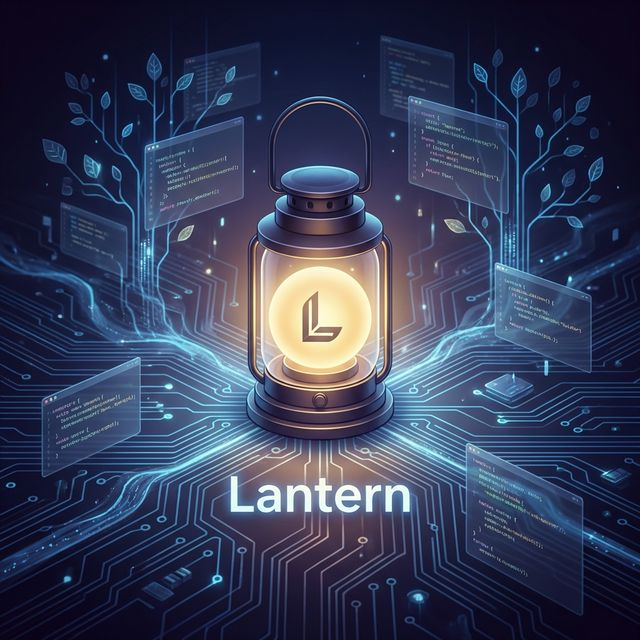
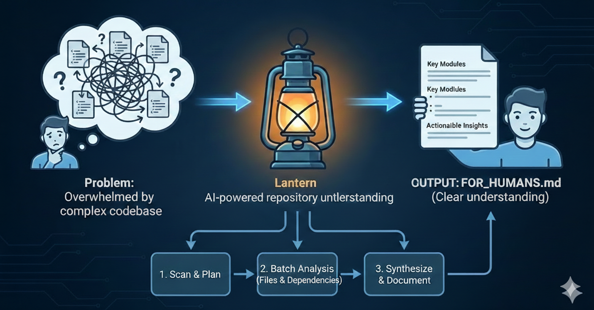

# Lantern

> **在黑暗的程式碼森林中，照亮你的方向。**

[English](README.md) | [繁體中文]



**Lantern 是你的 CLI 導師，將複雜的 Repository 轉化為循序漸進的敘事流程。**

透過 AI 引導的架構掃描、規劃好的學習路徑以及人類可讀的指南，更快速地理解程式碼庫。

**說你的語言**：邏輯已經夠複雜了。Lantern 使用你的母語（中文、日文、西班牙文等）解釋程式碼，同時保持技術術語的精確性。

### ✨ 亮點

| | |
| :--- | :--- |
| 🧠 **認知負擔減輕** | 基於心理學的區塊化設計（米勒定律），將分析拆解為可消化的小批次 |
| 🌐 **母語輸出** | 技術文檔以你的母語呈現——中文、日文、西班牙文等 |
| 📈 **流程重建** | Sequence Diagram 展示 `request → service → db → response` |
| 💡 **概念萃取** | 核心認知模型：認證流程、快取策略、重試機制 |
| 📊 **視覺化鷹架** | Mermaid 架構圖 + Sequence Diagram |
| 🔒 **本地優先、隱私可控** | CLI 原生運行，無需上傳雲端——適合企業與工作環境 |

---

# 為什麼需要 Lantern

理解一個陌生的程式碼庫非常困難。

你通常會遇到：
* 不知道該從哪個檔案開始看起。
* 文件過時或根本不存在。
* 隱藏的系統架構依賴關係。
* 需要閱讀數十個檔案才能理解一個核心概念。

**AI 產生的程式碼問題**

在 2024 年以後，程式碼庫中越來越多 AI 生成的程式碼：
* 能運作，但沒有人完全理解*為什麼*
* 缺乏有意義的註解或文檔
* 讓 Legacy Code 更難理解

大多數 AI 工具幫助你：
* 寫程式碼 (Write code)。
* 重構程式碼 (Refactor code)。

**Lantern 的目標截然不同：**
> Lantern 幫助你「理解」(Understand) 程式碼——無論是人寫的還是 AI 生成的。

---

# 應用場景 (Use Cases)

| 場景 | Lantern 如何幫助 |
| :--- | :--- |
| 👤 **新人 Onboarding** | 快速理解複雜遺留系統，無需依賴「部落知識」 |
| 🔧 **重構前分析** | 評估修改影響範圍，降低風險 |
| ⚠️ **技術債務評估** | 識別高風險模組與隱藏依賴 |
| 🏗️ **架構決策輔助** | 透過清晰的系統視野做出更好的設計選擇 |
| 🔍 **Code Review 準備** | 在審查 PR 前先理解陌生程式碼 |

---

# 核心特色 (Key Features)

### 🧠 心理學導向設計
不僅是文檔生成——**專為人類理解而設計**。區塊化、鷹架效應、母語輸出大幅降低認知負擔。

### 🔄 雙向分析視角
**Bottom-up**（逐檔細節）+ **Top-down**（架構總覽）= 從任何角度完整理解。

### 🔌 適應性後端
支援你偏好的 AI CLI：Codex、Gemini、Claude。更換後端無需改變工作流程。

### ✏️ 人機協作
在執行前審查並編輯 `lantern_plan.md`。你掌控分析的內容與方式。

# Lantern 的功能

**一次指令。完整文檔。**

```bash
lantern run
```

Lantern 分析你的 Repository 並產生一個 **完整的文檔庫**：



### 輸入
```
path to repo
```

### 輸出
```
.lantern/output/
├── en/
│   ├── top_down/                    # 📖 高層次指南
│   │   ├── OVERVIEW.md             # 專案願景與範圍
│   │   ├── ARCHITECTURE.md         # 系統設計與模組關係
│   │   ├── CONCEPTS.md             # 核心概念（認證流程、快取、重試）
│   │   ├── FLOWS.md                # 關鍵資料流 (Sequence Diagrams)
│   │   └── GETTING_STARTED.md      # 新手上手指南
│   │
│   └── bottom_up/                   # 📝 逐檔分析
│       └── src/                     # 鏡像你的 repo 結構
│           ├── kernel/
│           │   ├── scheduler.py.md  # 詳細拆解
│           │   └── events.py.md
│           └── api/
│               └── routes.py.md
│
└── zh-TW/                           # 🌐 母語版本
    └── (同上結構)
```

### 如何確保品質

Lantern 內部使用 **批次分析** 來控制品質：
- 檔案以小批次分析（1-3 個相關檔案）
- 每個批次建立在前一批次的脈絡之上
- 確保 **可追溯性** 與 **一致的推理**

你不需要管理這些——只要執行 `lantern run` 讓它運作。

---

# 核心概念

Lantern 的設計基於心理學原則：

### 區塊化 (Chunking - 米勒定律)
我們嚴格限制每個分析批次僅包含約 3 個相關檔案，以防止大腦產生資訊過載。

### 鷹架效應 (Scaffolding)
透過先行生成計畫並允許人工審查，我們為理解複雜系統搭建了穩固的階梯。

### 人類優先輸出 (Human-First Output)
最終產出是專為人類閱讀設計，而非機器消耗，重點在於解釋「為什麼」與「如何運作」，而不僅僅是「做了什麼」。

---

# 快速上手

## 前置需求

Lantern 需要安裝以下其中一個 AI CLI 工具：

| CLI 工具 | 安裝指令 |
| :--- | :--- |
| **Codex CLI** | `npm install -g @openai/codex` |
| **Gemini CLI** | `npm install -g @anthropic/gemini-cli` |
| **Claude Code** | `npm install -g @anthropic/claude-code` |

Lantern 會自動偵測可用的 CLI 後端。

## 安裝

```bash
pip install lantern-cli
```

## 簡易模式（推薦）

```bash
# 在當前目錄執行（輸出至 .lantern/）
lantern run

# 指定輸入與輸出
lantern run --repo ~/projects/my-app --output ~/docs/my-app-docs
```

Lantern 自動偵測可用的 CLI 後端：`codex` → `gemini` → `claude`

## 進階模式

若需要審查分析計畫：

```bash
# Step 1: 初始化
lantern init --repo /path/to/repo

# Step 2: 生成計畫（審查 lantern_plan.md）
lantern plan

# Step 3: 執行分析
lantern run
```

## 指定後端

```bash
lantern run --backend claude
lantern run --backend gemini
```

---

# 實際範例

分析 [accellera-official/systemc](https://github.com/accellera-official/systemc)：

**Top-down 輸出** (`ARCHITECTURE.md`)：
> SystemC 實際上是一個 **專為硬體模擬設計的協作式多任務作業系統**。
> 其核心是 `sc_simcontext`，充當核心、排程器和事件管理器。

**Bottom-up 輸出** (`sc_simcontext.md`)：
> `sc_simcontext` 是 SystemC 模擬核心的 **中樞神經系統**。
> 它管理：全域模擬狀態、物件註冊表、排程器、處理程序管理。

---

# 實例展示：Lantern 自我分析

以下是 Lantern 分析自身程式碼庫 (`lantern-cli`) 後生成的架構報告摘要 (由 `lantern run --lang zh-TW` 生成)：

### [生成的] 專案總覽 (Project Overview)

**Lantern CLI** 是一個基於 Python 的命令行工具，旨在協助開發者快速理解陌生的程式碼庫。

#### 核心架構
系統採用 **PipelinePattern (管線模式)** 設計，主要由以下模組組成：

1.  **CLI 層 (`src/lantern_cli/cli`)**
    -   使用 `Typer` 框架處理命令行輸入 (`main.py`)。
    -   負責協調 `init`, `plan`, `run` 三大指令的執行流程。

2.  **核心層 (`src/lantern_cli/core`)**
    -   **Architect (`architect.py`)**: 擔任「建築師」角色，負責分析依賴圖 (`DependencyGraph`) 並生成分批次的分析計畫 (`lantern_plan.md`)。
    -   **Runner (`runner.py`)**: 擔任「執行者」，負責與 LLM 後端溝通，執行批次分析，並具備斷點續傳 (`StateManager`) 功能。
    -   **Synthesizer (`synthesizer.py`)**: 擔任「合成器」，將零散的批次分析結果 (`.sense` 檔) 彙整為最終的 Top-down 文件。

3.  **後端適配層 (`src/lantern_cli/backends`)**
    -   透過 `BackendFactory` 實現策略模式 (Strategy Pattern)。
    -   支援多種 LLM 後端：`CodexAdapter`, `GeminiAdapter`, `ClaudeAdapter`。
    -   抽象化了不同 CLI 工具的調用細節。

---

# 設定

## 語言設定

你可以設定偏好的輸出語言（如繁體中文、日文），進一步降低認知門檻。

**方法 A：命令列參數**
```bash
lantern run --lang zh-TW
```

---

# 支援的代理 (Agents)

Lantern 驅動你喜愛的 CLI Agents：
* Claude Code
* Gemini CLI (Antigravity)
* 開源本地執行器 (Local Runners)

---

# 發展藍圖 (Roadmap)

- [ ] **Execution Trace Mode**：透過 unit test 收集 call graph，實現動態分析。
- [ ] **跨批次推論**：加強跨批次邊界的邏輯關聯分析。
- [ ] **多語言靜態分析支援**：擴展至 Go, Rust, 與 Java。
- [ ] **VSCode 延伸插件**：整合進度追蹤與可視化。

---

# 參與貢獻

歡迎提交 PR！幫助我們打造理解程式碼的終極工具。

---

# 授權協定

MIT
