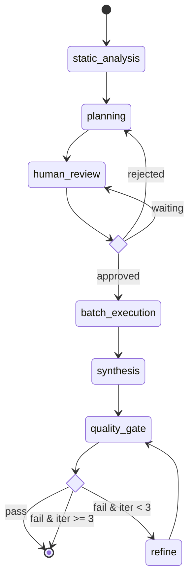
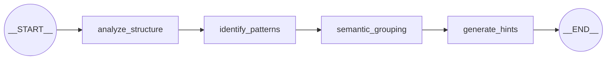
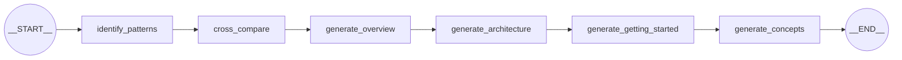
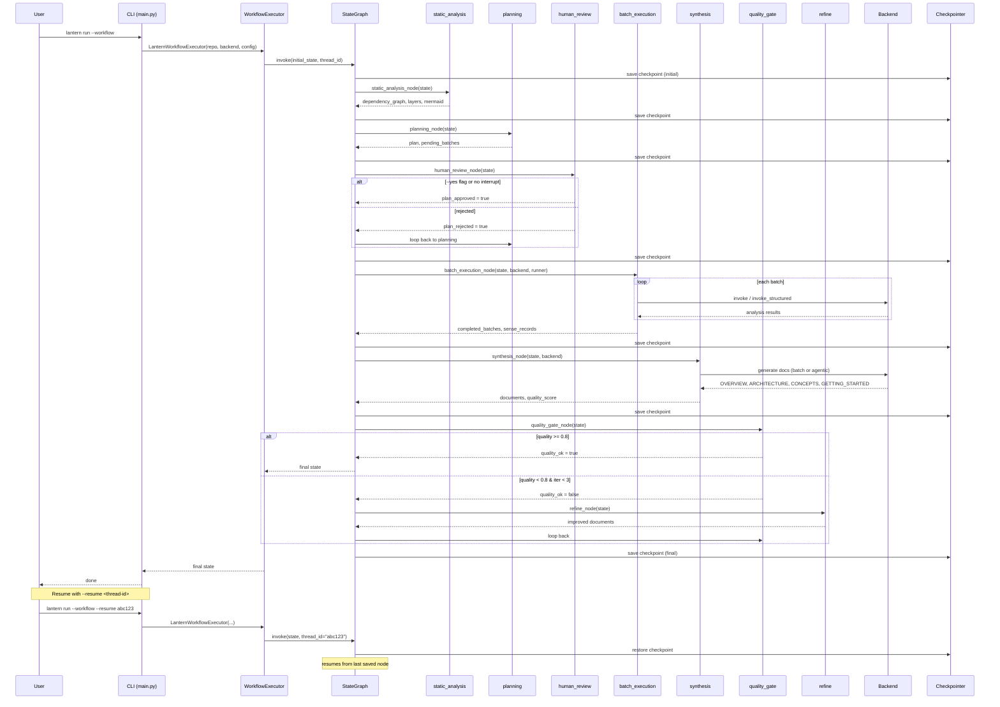

# LangGraph Architecture Design

This document describes the LangGraph StateGraph designs used in Lantern CLI.
All diagrams use Mermaid syntax (rendered natively by GitHub).

---

## A. Main Workflow Graph

The primary orchestration graph in `core/workflow.py`. It has **7 nodes** and
**2 conditional routers** (human review and quality gate).

### Node Summary

| Node | Source | Responsibility |
|------|--------|----------------|
| `static_analysis` | `workflow.py` | Build dependency graph, calculate layers, generate Mermaid |
| `planning` | `workflow.py` | Generate `Plan` (static or agentic mode) |
| `human_review` | `workflow.py` | Interrupt for plan approval; auto-approves with `--yes` |
| `batch_execution` | `workflow.py` | Process batches via `Runner` with `EnhancedContextManager` |
| `synthesis` | `workflow.py` | Generate top-down docs (batch or agentic mode) |
| `quality_gate` | `workflow.py` | Evaluate synthesis quality score against 0.8 threshold |
| `refine` | `workflow.py` | Bump quality score and loop back (max 3 iterations) |

### Conditional Routers

- **`router_human_review`** — routes to `batch_execution` (approved), `planning` (rejected), or `human_review` (waiting for input).
- **`router_quality_gate`** — routes to `END` (quality >= 0.8 or max iterations reached) or `refine` (quality < 0.8 and iterations < 3).

### State

`LanternWorkflowState` (TypedDict) carries all data across nodes: input
parameters, static analysis results, plan, batch execution records, synthesis
documents, quality metrics, and iteration count.

---

## B. Agentic Planner Sub-Graph

A 4-node linear sub-graph in `core/agentic_planner.py`. Used when
`--planning-mode agentic` is set. Each node invokes the LLM to progressively
build understanding of the codebase for smarter file grouping.

### Node Summary

| Node | Input | Output |
|------|-------|--------|
| `analyze_structure` | file tree, dependencies, layers, sampled file contents | `structure_analysis` (free-text) |
| `identify_patterns` | `structure_analysis`, sampled contents, dependencies | `patterns_analysis` (free-text) |
| `semantic_grouping` | file list, `patterns_analysis`, dependencies, layers | `semantic_groups_json` (JSON array of file groups) |
| `generate_hints` | semantic groups, `patterns_analysis`, `structure_analysis` | `batch_hints_json` (JSON map: batch index -> hint) |

### State

`PlanningState` (TypedDict) contains input data (file tree, dependency summary,
layer summary, sampled contents) and LLM-generated intermediate results.

---

## C. Agentic Synthesizer Sub-Graph

A 6-node linear sub-graph in `core/agentic_synthesizer.py`. Used when
`--synthesis-mode agentic` is set. Each node builds on prior analysis to
produce richer documentation.

### Node Summary

| Node | Input | Output |
|------|-------|--------|
| `identify_patterns` | sense records | `patterns_analysis` |
| `cross_compare` | `patterns_analysis`, sense records | `cross_comparison` |
| `generate_overview` | `patterns_analysis`, `cross_comparison`, sense records | `overview_doc` (OVERVIEW.md) |
| `generate_architecture` | `patterns_analysis`, `cross_comparison`, dependency Mermaid, file details | `architecture_doc` (ARCHITECTURE.md) |
| `generate_getting_started` | `overview_doc`, `patterns_analysis`, functions, entry points | `getting_started_doc` (GETTING_STARTED.md) |
| `generate_concepts` | `patterns_analysis`, `cross_comparison`, classes summary | `concepts_doc` (CONCEPTS.md) |

### State

`SynthesisState` (TypedDict) contains sense records, plan content, dependency
Mermaid, and the progressively generated documents.

---

## D. End-to-End Sequence: `lantern run --workflow`

Shows the interaction between CLI, workflow executor, graph nodes, and LLM
backend during a complete run, including checkpoint/resume.

---

## Key Design Decisions

1. **Checkpointing** — Every node transition is checkpointed via LangGraph's
   `MemorySaver` (default) or `SqliteSaver` (when a checkpoint directory is
   configured). This enables `--resume <thread-id>`.

2. **Human-in-the-loop** — `human_review` supports plan approval/rejection.
   Currently auto-approves when `--yes` is set or no interrupt mechanism is
   configured.

3. **Quality loop** — The `quality_gate -> refine -> quality_gate` cycle runs
   up to 3 iterations, incrementally improving synthesis quality.

4. **Sub-graph isolation** — The agentic planner and synthesizer are compiled
   as independent `StateGraph` instances. They are invoked within the main
   workflow's `planning_node` and `synthesis_node` respectively, keeping
   concerns separated.

5. **Backend protocol** — All LLM calls go through the `Backend` protocol
   (`llm/backend.py`), keeping provider-specific code isolated in
   `llm/backends/`.
