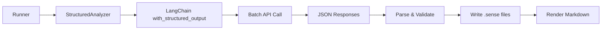
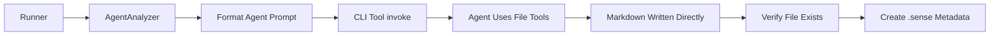

# Lantern Specification

> **Lantern — Your repository mentor.**

## 1. 核心願景 (Core Vision)

Lantern 是一個基於 CLI Agent 的儲存庫（Repository）分析工具。其核心目的不是單純的「生成文檔」，而是透過心理學引導與結構化拆解，幫助開發者在最低認知負擔的情況下，快速且深度地理解一個陌生的程式碼庫。

### 1.1 LLM 後端策略 (LLM Backend Strategy)

> [!IMPORTANT]
> **實作變更**（2025-02）：Lantern 已遷移至 **LangChain 架構**，直接整合 LLM 提供者，不再使用 CLI wrapper 或原始 SDK。

本工具支援兩種後端選項：

#### 1.1.1 Ollama 後端（本地模型）✅ 已實作

> [!TIP]
> 適合離線工作、敏感程式碼庫、零 API 成本場景。

- **完全本地執行**：使用 LangChain 的 `ChatOllama`
- **隱私保障**：程式碼不離開本機
- **零成本**：無 API 費用
- **支援模型**：Qwen2.5、Llama3、Mistral 等所有 Ollama 模型

**配置範例**：
```toml
[backend]
type = "ollama"
ollama_model = "qwen2.5:14b"
# ollama_base_url = "http://localhost:11434"  # 可選
```

#### 1.1.2 OpenAI 後端（直接 API）✅ 已實作

> [!TIP]
> **生產環境推薦**：穩定、快速、成本效益高。

- **官方 API**：直接使用 OpenAI API（非透過代理）
- **LangChain 整合**：使用 `ChatOpenAI`
- **成本效益**：gpt-4o-mini 非常便宜（$0.15/1M 輸入 tokens）
- **穩定可靠**：OpenAI 官方支援，SLA 保障

**配置範例**：
```toml
[backend]
type = "openai"
openai_model = "gpt-4o-mini"  # 推薦：快速且便宜
# openai_model = "gpt-4o"     # 更高品質選項
```

**環境變數**：
```bash
export OPENAI_API_KEY="sk-..."
```

**定價**（2025）：
- gpt-4o-mini: $0.15/1M 輸入，$0.60/1M 輸出
- gpt-4o: $2.50/1M 輸入，$10/1M 輸出

#### 1.1.3 OpenRouter 後端（多模型存取）✅ 已實作

> [!TIP]
> 適合需要存取多個供應商模型的場景（Claude、Gemini 等）。

- **LangChain 整合**：使用 `ChatOpenAI` 搭配 OpenRouter 端點
- **模型選擇豐富**：支援所有 OpenRouter 提供的模型
- **成本透明**：執行前顯示估算成本
- **線上定價**：自動從 GitHub 取得最新定價（https://raw.githubusercontent.com/powei-lin/repo-lantern/main/pricing.json）

**配置範例**：
```toml
[backend]
type = "openrouter"
openrouter_model = "openai/gpt-4o-mini"
# openrouter_model = "anthropic/claude-sonnet-4"
```

**環境變數**：
```bash
export OPENROUTER_API_KEY="sk-or-v1-..."
```

#### 1.1.4 CLI 後端（Agent-Based）✅ 已實作 (2025-02)

> [!TIP]
> **全新 Agent 工作流**：適合具有檔案工具能力的 CLI 工具（codex exec, claude, llm 等）。

- **Agent 模式**：CLI 工具使用檔案工具直接寫入 Markdown 文件
- **靈活整合**：支援任何接受 stdin 輸入並輸出到 stdout 的 CLI
- **無需 JSON 解析**：Agent 直接寫檔案，避免結構化輸出問題
- **雙分析器架構**：自動偵測 CLI 後端並切換至 Agent 工作流

**配置範例**：
```toml
[backend]
type = "cli"
cli_command = "codex exec"  # 或 "llm -m gpt-4o-mini", "claude" 等
cli_model_name = "cli"
```

**支援的 CLI 工具**：
- `codex exec` - OpenAI Codex（具備 Agent 能力）
- `llm -m <model>` - Simon Willison 的 LLM 工具
- `claude` - Anthropic Claude CLI
- 自訂 CLI wrapper

**技術細節**：詳見 [3.5 雙分析器架構](#35-雙分析器架構)

### 1.2 心理學設計準則 (Psychological Design Principles)

- **塊狀化處理 (Chunking - Miller's Law)**: 嚴格限制每個批次（Batch）僅處理 3 個相關檔案，防止大腦產生資訊過載。
- **鷹架效應 (Scaffolding)**: 透過先生成計畫、再由人工微調、最後逐步執行的流程，為理解複雜系統搭建穩固的階梯。
- **母語預熱 (Native Language Priming)**: 最後階段將技術邏輯轉譯為使用者的母語，消除閱讀外語技術文件帶來的額外認知負擔。

---

## 2. 實作狀態 (Implementation Status)

> [!NOTE]
> 以下表格顯示各元件的當前實作狀態（截至 2025-02）

| 元件 | 狀態 | 備註 |
| :--- | :--- | :--- |
| **核心架構** | | |
| Architect (規劃器) | ✅ 完成 | 依賴圖分析、批次規劃、Mermaid 圖生成 |
| Runner (執行器) | ✅ 完成 | LangChain 整合、批次恢復、Temporal RAG |
| Synthesizer (合成器) | ✅ 完成 | Bottom-up + Top-down 文件生成、Mermaid 嵌入 |
| Memory Manager | ✅ 完成 | LLM 壓縮、自動上下文管理 |
| **靜態分析** | | |
| Python 分析 | ✅ 完成 | AST-based import 提取 |
| C++ 分析 | ✅ 完成 | #include 解析 |
| 檔案過濾 | ✅ 完成 | .gitignore + pathspec 支援 |
| 依賴圖生成 | ✅ 完成 | 分層計算、模組解析 |
| **LLM 後端** | | |
| Ollama 後端 | ✅ 完成 | 本地模型支援（LangChain） |
| OpenAI 後端 | ✅ 完成 | 直接 API 支援（生產環境推薦） |
| OpenRouter 後端 | ✅ 完成 | 雲端 API 支援（多模型存取） |
| CLI 後端 (Agent-Based) | ✅ 完成 | Agent 模式支援（codex, llm, claude 等） |
| API 後端 (Gemini/Claude SDK) | ❌ 未實作 | 規劃中，目前透過 OpenRouter 使用 |
| **分析器架構** | | |
| StructuredAnalyzer | ✅ 完成 | LangChain 後端的 JSON 批次分析 |
| AgentAnalyzer | ✅ 完成 | CLI 後端的 Agent 檔案寫入模式 |
| 雙分析器路由 | ✅ 完成 | 自動偵測後端類型並選擇工作流 |
| **新功能（規範外）** | | |
| Mermaid 圖表生成 | ✅ 完成 | 每個檔案自動生成流程圖 + 架構圖 |
| 結構化輸出 | ✅ 完成 | Pydantic + JSON Schema 驗證 |
| 成本追蹤 | ✅ 完成 | 線上定價取得、執行前估算 |
| 檢查點恢復 | ✅ 完成 | 狀態持久化、失敗重啟 |
| **CLI 命令** | | |
| `lantern init` | ✅ 完成 | 初始化專案目錄 |
| `lantern plan` | ✅ 完成 | 生成分析計畫 |
| `lantern run` | ✅ 完成 | 完整流程執行 |
| **未來擴充** | | |
| Execution Trace Mode | 🔵 規劃中 | 動態分析支援 |
| Incremental Update | 🔵 規劃中 | 增量更新模式 |
| VSCode Extension | 🔵 規劃中 | IDE 整合 |

### 2.1 最近變更 (Recent Changes)

> [!NOTE]
> **2025-02-16**: 實作雙分析器架構與 CLI Agent 支援

#### 新增功能：

1. **CLI Agent 後端支援** ✅
   - **功能**：支援 CLI 工具（codex exec, llm, claude 等）的 Agent 模式
   - **架構**：實作 AgentAnalyzer 類別，讓 Agent 直接寫入 Markdown 檔案
   - **自動路由**：Runner 與 Synthesizer 自動偵測 CLIBackend 並切換工作流
   - **影響**：CLI 工具不再強制輸出 JSON，充分利用 Agent 檔案工具能力
   - **檔案**：
     - `src/lantern_cli/llm/agent_analyzer.py` (新增)
     - `src/lantern_cli/template/agent/prompts.json` (新增)
     - `src/lantern_cli/core/runner.py` (修改)
     - `src/lantern_cli/core/synthesizer.py` (修改)

2. **雙分析器架構** ✅
   - **設計理念**：不同後端使用不同分析器，發揮各自優勢
   - **StructuredAnalyzer**：LangChain 後端（Ollama, OpenAI, OpenRouter）使用 JSON 批次處理
   - **AgentAnalyzer**：CLI 後端使用 Agent 直接檔案寫入
   - **Backend Protocol**：統一介面抽象，支援未來擴展
   - **影響**：解決 CLI 工具 JSON 解析問題，提升文件品質

> [!NOTE]
> **2025-02-14**: 重大錯誤修復與功能調整

#### 修復項目：

1. **Schema 格式錯誤修復** ✅
   - **問題**：`schema.json` 混用 JSON Schema 與 OpenAI function 格式，導致 `KeyError: 'parameters'`
   - **修復**：重構為正確的 OpenAI function format（包含 `name`、`description`、`parameters`）
   - **影響**：修復前所有批次分析都會失敗
   - **檔案**：`src/lantern_cli/template/bottom_up/schema.json`

2. **模型名稱配置修復** ✅
   - **問題**：後端類型檢查錯誤，檢查 `"api"` 而非 `"openai"` 或 `"openrouter"`
   - **修復**：正確處理 OpenAI 與 OpenRouter 後端類型
   - **影響**：成本追蹤顯示錯誤的模型名稱（gemini-1.5-flash 而非 gpt-4o-mini）
   - **檔案**：`src/lantern_cli/cli/main.py`

3. **ChatOpenAI 參數修復** ✅
   - **問題**：使用已棄用的 `model_name` 參數
   - **修復**：改用正確的 `model` 參數
   - **影響**：與最新版 langchain-openai 相容
   - **檔案**：`src/lantern_cli/llm/openai.py`

#### 功能調整：

4. **移除風險欄位 (Risks Field Removal)** ✅
   - **理由**：文檔目的為幫助讀者理解程式碼，而非風險評估
   - **變更內容**：
     - 從提示詞移除風險相關指示（`prompts.json`）
     - 從結構化輸出模型移除 `risks` 欄位（`structured.py`）
     - 從 bottom-up 文件渲染移除風險區塊（`runner.py`）
     - 從 top-down 合成移除風險提取（`synthesizer.py`）
   - **影響**：Bottom-up 文件不再包含 "## Risks" 區塊，CONCEPTS.md 不再顯示 ⚠️ 風險項目

---

## 3. 系統架構 (System Architecture)

### A. 建築師代理 (The Architect Agent)

**職責**: 走訪 Repo 目錄，理解依賴關係，並規劃執行路徑。

#### 靜態分析輔助 (Static Analysis Assistance)

> [!IMPORTANT]
> LLM 不擅長直接掃描大型目錄結構來判斷依賴關係。Architect 採用「混合模式」：
> - **傳統工具收集數據**：使用 `tree-sitter`、`grep`、AST 解析器等靜態分析工具
> - **LLM 做決策**：基於收集的數據，LLM 規劃分析路徑

**支援的靜態分析工具**:
- **Python**: `ast` 模組解析 import 語句
- **JavaScript/TypeScript**: `tree-sitter` 解析依賴
- **通用**: `ripgrep` 搜尋關鍵字（如 `import`, `require`, `use`）

這避免了 LLM 的「幻覺」問題，確保依賴圖的準確性。

#### 檔案過濾與排除機制 (File Filtering)

> [!TIP]
> 排除不必要的檔案可大幅節省 API 成本。

**預設排除規則**：
- 自動尊重 `.gitignore` 中的檔案
- 預設排除目錄：`node_modules/`, `vendor/`, `build/`, `dist/`, `.git/`
- 預設排除檔案：`*.min.js`, `*.map`, `*.lock`

**配置範例** (`lantern.toml`)：
```toml
[filter]
# 額外排除規則
exclude = [
    "tests/",
    "docs/",
    "*.generated.*",
    "migrations/"
]

# 強制包含（覆蓋排除）
include = [
    "tests/integration/"  # 即使 tests/ 被排除，仍分析 integration tests
]
```

**目的**：避免分析不必要的程式碼（如第三方庫、生成檔案），節省 Token 與成本。

**Architect Prompt 範本**:

```markdown
你現在是 Lantern 的「建築師代理」。你的任務是基於靜態分析結果，規劃一份分析計畫。

輸入數據：
- 目錄結構: [tree output]
- 依賴關係圖: [parsed imports]
- 核心模組列表: [detected modules]

生成計畫：
請撰寫一份 lantern_plan.md。

硬性約束：
- 將任務劃分為多個 Phase（功能模組）。
- 每個 Phase 下劃分多個 Batch，每個 Batch 嚴格限制處理 1-3 個檔案。
- 針對每個 Batch，說明為什麼將這幾個檔案放在一起分析（基於認知負荷最小化原則）。
- 標註哪些地方需要人工介入確認。
```

**產出**: `lantern_plan.md` (結構化的待辦清單)。

**規則**:
- 每個 Phase 必須對應一個功能模組。
- 每個 Batch 不得超過 3 個檔案。
- 必須包含「為什麼這三個檔案放在一起」的解釋。

### B. 執行協調員 (The Python Runner/Walker)

**職責**: 自動化驅動 CLI 工具（如 Gemini CLI, Antigravity, Claude CLI）。

**功能**:
- **Watchdog**: 監控 Log 更新，偵測超時或中斷。
- **State Persistence**: 維護 `.lantern/state.json`，解決 CLI 工具「無狀態」的問題。
- **Temporal RAG**: 將 `global_summary` 注入每個 Batch 的 System Prompt，實現跨批次知識傳遞。
- **Intervention Gate**: 在 Phase 結束時自動暫停，確認使用者理解程度。

#### 時序性 RAG (Temporal RAG)

Batch N 需要 Batch 1 到 N-1 的知識。Runner 透過以下機制實現：

1. 每個 Batch 完成後，更新 `.lantern/state.json` 的 `global_summary`
2. 執行 Batch N 時，將 `global_summary` 注入 System Prompt：

```markdown
You are analyzing Batch {N}.

Context from previous batches:
{global_summary}

Now analyze:
- {file1}
- {file2}
```

這確保了邏輯的連貫性，避免重複推理。

#### 狀態恢復與斷點續傳 (Checkpoint Resume)

> [!IMPORTANT]
> 長時間運行的分析可能因 CLI 失敗、網路中斷等原因中斷。Lantern 支援完整的斷點續傳。

**恢復機制**：
1. 重新執行 `lantern run` 時，自動檢測 `.lantern/state.json`
2. 跳過已完成的 Batch（檢查 `.lantern/sense/batch_{N}.sense` 是否存在）
3. 從上次失敗的 Batch 繼續執行

**狀態檔範例** (`.lantern/state.json`)：
```json
{
  "status": "in_progress",
  "last_completed_batch": 49,
  "total_batches": 120,
  "failed_batch": 50,
  "failure_reason": "CLI timeout after 300s",
  "resume_from": 50
}
```

**使用效果**：
- `lantern run` 在 Batch 50 失敗後重新執行，自動從 Batch 50 繼續
- 已生成的 `.sense` 碧片與 bottom-up 文檔保留不重建

### C. 合成器 (The Synthesizer)

**職責**: 生成結構化的 Markdown 文檔庫，提供 Bottom-up 與 Top-down 兩種視角。

#### 雙階段生成策略

Synthesizer 採用**漸進式生成**，而非一次性產出：

**階段 1: Bottom-up 生成**（在 Batch 分析過程中）
- 每個 Batch 完成後，立即生成對應檔案的 `.md` 文檔
- 輸出位置：`.lantern/output/{lang}/bottom_up/`，結構完全鏡像原 Repository
- 每個 `.md` 文件包含：
  - 檔案用途與職責
  - 關鍵函數/類別說明
  - 依賴關係
  - 使用範例

**階段 2: Top-down 合成**（所有 Batch 完成後）
- 讀取所有 `.sense` 檔案與 bottom-up 文檔
- 使用高品質模型（Claude Sonnet, GPT-4o）生成高層次指南
- 輸出位置：`.lantern/output/{lang}/top_down/`

#### 輸出目錄結構

```
.lantern/output/
├── en/                          # 預設語言（英文）
│   ├── top_down/
│   │   ├── OVERVIEW.md         # 專案願景與範圍
│   │   ├── ARCHITECTURE.md     # 系統架構與模組關係
│   │   ├── CONCEPTS.md         # 核心概念（認證流程、快取策略、重試機制）
│   │   ├── FLOWS.md            # 關鍵資料流 (Sequence Diagrams)
│   │   └── GETTING_STARTED.md  # 新手上手指南
│   └── bottom_up/
│       ├── src/
│       │   ├── auth.py.md      # 鏡像 src/auth.py
│       │   ├── models.py.md    # 鏡像 src/models.py
│       │   └── api/
│       │       └── routes.py.md
│       └── tests/
│           └── test_auth.py.md
└── zh-TW/                       # 可選語言（繁體中文）
    ├── top_down/
    │   └── (同 en 結構)
    └── bottom_up/
        └── (同 en 結構)
```

#### Bottom-up 文檔範例

**檔案**: `.lantern/output/en/bottom_up/src/auth.py.md`

```markdown
# auth.py

\u003e **Location**: `src/auth.py`

## Purpose
Handles user authentication and JWT token generation.

## Key Components

### `authenticate(username, password)`
Validates user credentials against the database.

**Dependencies**:
- `models.User`
- `utils.hash_password`

**Returns**: `User` object or `None`

### `generate_jwt(user_id)`
Creates a JWT token for authenticated users.

**Example**:
\`\`\`python
token = generate_jwt(user.id)
\`\`\`
```

#### Top-down 文檔範例

**檔案**: `.lantern/output/en/top_down/ARCHITECTURE.md`

```markdown
# Architecture Overview

## System Design

Lantern follows a layered architecture:

1. **API Layer** (`src/api/`)
   - RESTful endpoints
   - Request validation

2. **Business Logic** (`src/auth.py`, `src/models.py`)
   - Authentication
   - Data models

3. **Data Layer** (`src/db/`)
   - Database connections
   - Migrations

## Module Relationships

\`\`\`mermaid
graph LR
    API --> Auth
    API --> Models
    Auth --> Models
    Models --> DB
\`\`\`
```

---

### D. Mermaid 圖表自動生成 ✅ 新功能（2025-02）

> [!TIP]
> Mermaid 圖表生成是 Lantern 的重要差異化特性，自動為每個檔案生成視覺化流程圖。

#### 設計理念

傳統文檔工具需要手動繪製架構圖，費時且容易過時。Lantern 利用 LLM 的程式碼理解能力，自動生成 **Mermaid 語法圖表**，嵌入文檔中。

#### Schema 定義

在 `template/bottom_up/schema.json` 中新增 `flow_diagram` 欄位：

```json
{
  "flow_diagram": {
    "type": "string",
    "description": "Mermaid diagram (graph TD or sequenceDiagram) showing execution flow. Max 2000 chars.",
    "maxLength": 2000
  }
}
```

#### Prompt Engineering

在 `template/bottom_up/prompts.json` 中指示 LLM 生成簡潔圖表：

```json
{
  "user": "For the `flow_diagram` key, produce a Mermaid diagram (graph TD or sequenceDiagram) illustrating the main execution or data flow. Keep it concise (5-10 nodes max). Use middle-school student friendly language. Do NOT include ``` fences — just the raw Mermaid syntax."
}
```

**關鍵設計決策**：
- **無圍欄語法**：不包含 ` ```mermaid` 標記，由 Synthesizer 負責包裝
- **簡潔性約束**：限制 5-10 個節點，避免圖表過於複雜
- **語法選擇**：支援 `graph TD`（流程圖）與 `sequenceDiagram`（序列圖）
- **國中生友善**：使用簡單易懂的節點標籤

#### 整合方式

**階段 1：Bottom-up 生成**
- Runner 執行 Batch 分析時，LLM 產生 `flow_diagram` 欄位
- 儲存至 `.sense` 檔案的 JSON 中
- 立即嵌入對應的 `.md` 文檔：

```markdown
# auth.py

## Flow Diagram

\`\`\`mermaid
sequenceDiagram
    User->>authenticate(): username, password
    authenticate()->>DB: check_credentials()
    DB-->>authenticate(): user_data
    authenticate()->>generate_jwt(): user_id
    generate_jwt()-->>User: JWT token
\`\`\`
```

**階段 2：Top-down 合成**
- Synthesizer 從所有 `.sense` 檔案提取 `flow_diagram`
- 整合至 `ARCHITECTURE.md` 與 `GETTING_STARTED.md`：

**ARCHITECTURE.md** - 嵌入全域依賴圖：
```markdown
## Module Relationships

\`\`\`mermaid
graph LR
    API --> Auth
    API --> Models
    Auth --> Database
    Models --> Database
\`\`\`
```

**GETTING_STARTED.md** - 展示關鍵流程：
```markdown
## Request Flow

\`\`\`mermaid
sequenceDiagram
    User->>API: POST /login
    API->>Auth: validate()
    Auth->>DB: check_credentials()
    DB-->>Auth: user_data
    Auth-->>API: token
    API-->>User: 200 OK
\`\`\`
```

#### 備援機制

若 LLM 未生成 `flow_diagram`（或欄位為空），Synthesizer 使用**參考回退邏輯**：

```python
def _references_to_mermaid(self, references: list[str]) -> str:
    """將 references 欄位轉換為簡單 Mermaid 圖"""
    # 過濾出實際檔案引用（排除敘述性文字）
    file_refs = [ref for ref in references if '/' in ref or '.py' in ref]

    if not file_refs:
        return ""

    # 生成簡單的依賴圖
    mermaid = "graph LR\n"
    for ref in file_refs[:5]:  # 最多 5 個節點
        sanitized_ref = ref.replace('/', '_').replace('.', '_')
        mermaid += f"    CurrentFile --> {sanitized_ref}\n"

    return mermaid
```

#### 實際效果

**輸入**（Python 檔案）：
```python
def authenticate(username, password):
    user = User.query.filter_by(username=username).first()
    if user and user.check_password(password):
        return generate_jwt(user.id)
    return None
```

**輸出**（自動生成的 Mermaid）：
```mermaid
sequenceDiagram
    User->>authenticate(): username, password
    authenticate()->>User.query: filter_by(username)
    User.query-->>authenticate(): user
    authenticate()->>user: check_password()
    user-->>authenticate(): True/False
    authenticate()->>generate_jwt(): user.id
    generate_jwt()-->>User: JWT token
```

#### 成本影響

Mermaid 生成對 token 成本的影響：
- **輸入增加**：Prompt 多約 50 tokens
- **輸出增加**：每個檔案多約 100-200 tokens（Mermaid 語法）
- **總成本增幅**：約 5-10%（相對於原始分析成本）

**權衡判斷**：視覺化價值遠高於微小的成本增加。

---

### E. 後端抽象層 (Backend Abstraction Layer)

> [!IMPORTANT]
> CLI 工具（如 `antigravity`, `gemini-cli`）的輸出格式非穩定 API，可能隨版本改變。
> 為確保長期穩定性，Lantern 必須透過 **Adapter Pattern** 隔離這些不穩定依賴。

#### Adapter 介面設計

所有 LLM 後端必須實作以下介面：

```python
from abc import ABC, abstractmethod
from dataclasses import dataclass
from typing import Optional

@dataclass
class AnalysisResult:
    summary: str
    key_insights: list[str]
    raw_output: str  # 原始 CLI/API 輸出，用於除錯

class BackendAdapter(ABC):
    """LLM 後端的抽象介面"""

    @abstractmethod
    def analyze_batch(
        self,
        files: list[str],
        context: str,
        prompt: str
    ) -> AnalysisResult:
        """分析一個 Batch 的檔案"""
        pass

    @abstractmethod
    def synthesize(
        self,
        sense_files: list[str],
        target_language: str
    ) -> str:
        """合成最終文檔"""
        pass

    @abstractmethod
    def health_check(self) -> bool:
        """檢查後端是否可用"""
        pass
```

#### 後端選項

| 後端類型 | 穩定性 | 成本 | 適用場景 |
| :--- | :--- | :--- | :--- |
| **API (推薦)** | ⭐⭐⭐ 高 | 較高 | 生產環境、需要穩定輸出 |
| **CLI Wrapper** | ⭐⭐ 中 | 較低 | 開發測試、利用最新 Agent 功能 |

#### 配置範例 (`lantern.toml`)

```toml
[backend]
# 可選: "api" | "cli"
type = "api"

# API 後端設定
[backend.api]
provider = "anthropic"  # "anthropic" | "openai" | "google"
model = "claude-sonnet-4-20250514"
api_key_env = "ANTHROPIC_API_KEY"

# CLI 後端設定（備用）
[backend.cli]
command = "antigravity"
timeout_seconds = 300
fallback_to_api = true  # CLI 失敗時自動切換到 API
```

#### 錯誤處理策略

CLI Wrapper 必須處理以下情況：
1. **超時 (Timeout)**：超過設定時間無輸出，視為失敗
2. **格式變更**：輸出無法解析時，記錄原始輸出並標記錯誤
3. **降級策略**：若 `fallback_to_api = true`，自動切換到 API 後端

---

### 3.5 雙分析器架構 (Dual Analyzer Architecture)

> [!IMPORTANT]
> **2025-02 重大架構變更**：Lantern 現採用**雙分析器架構**，根據後端類型自動選擇最適合的工作流。

#### 設計理念

**問題背景**：
在實作 CLI 後端支援時，我們發現強制要求具備 Agent 能力的 CLI 工具（如 `codex exec`）輸出結構化 JSON 會遇到以下問題：
1. **能力浪費**：CLI Agent 具備檔案工具能力，卻被限制只能輸出文字
2. **解析錯誤**：Agent 輸出的自然語言難以可靠地解析為 JSON
3. **品質下降**：強制 JSON 格式限制了 Agent 的表達能力

**解決方案**：
與其強制所有後端使用相同工作流，不如讓每種後端發揮其優勢：
- **LangChain 後端**（Ollama, OpenAI, OpenRouter）：使用 **StructuredAnalyzer** 進行高效 JSON 批次處理
- **CLI 後端**（codex, llm, claude）：使用 **AgentAnalyzer** 讓 Agent 直接寫入 Markdown 檔案

#### 架構比較

**方案 A：Structured Workflow（LangChain 後端）**



**特點**：
- ✅ 高效批次處理（一次 API 呼叫處理多個檔案）
- ✅ 結構化輸出（Pydantic 驗證）
- ✅ 成本可控（批次處理節省 token）
- ✅ 可靠性高（JSON Schema 驗證）

**方案 B：Agent Workflow（CLI 後端）**



**特點**：
- ✅ 充分利用 Agent 能力（檔案工具、程式碼執行）
- ✅ 無需 JSON 解析（Agent 直接寫檔）
- ✅ 更高品質（Agent 可自由表達）
- ⚠️ 成本稍高（逐檔處理）
- ⚠️ 需驗證檔案（確保 Agent 正確寫入）

#### 後端偵測機制

**自動路由邏輯**：

```python
# src/lantern_cli/core/runner.py
from lantern_cli.llm.backends.cli_backend import CLIBackend

def _generate_bottom_up_doc(self, batch: Batch) -> list[dict[str, Any]]:
    """自動偵測後端類型並選擇工作流"""
    if isinstance(self.backend, CLIBackend):
        logger.info("Using agent-based workflow for batch {batch.id}")
        return self._generate_bottom_up_doc_agent(batch)
    else:
        logger.info("Using structured workflow for batch {batch.id}")
        return self._generate_bottom_up_doc_structured(batch)
```

**Top-down 合成同樣支援雙工作流**：

```python
# src/lantern_cli/core/synthesizer.py
def generate_top_down_docs(self) -> None:
    """偵測後端並選擇合成策略"""
    if self.backend and isinstance(self.backend, CLIBackend):
        return self._generate_top_down_agent()
    else:
        return self._generate_top_down_structured()
```

**偵測依據**：
- 使用 Python `isinstance()` 檢查後端類型
- CLIBackend 實例 → Agent 工作流
- 其他後端（OllamaBackend, OpenAIBackend, OpenRouterBackend）→ Structured 工作流

#### Agent Prompts 設計

**檔案位置**：`src/lantern_cli/template/agent/prompts.json`

**Bottom-up Prompt 範例**：

```json
{
  "bottom_up": "You are Lantern, a code documentation agent.

Your task is to analyze a source file and create comprehensive Markdown documentation.

## Task
Analyze the file: `{source_file}`
Write the documentation to: `{output_path}`
Target language: {language}

## Instructions
1. Read and understand the source code provided below
2. Create a Markdown document with these sections:
   - **Title**: The filename as h1 heading
   - **Summary**: Concise overview (max 400 words) in {language}
   - **Key Insights**: Important patterns and decisions
   - **Functions**: List and describe functions
   - **Classes**: Describe classes and types
   - **Flow**: Execution flow description
3. Use your file writing tool to save the Markdown to: {output_path}
4. ALL text content MUST be in {language}

## Source Code
```
{file_content}
```

**CRITICAL**: You MUST use your file tool to write the complete Markdown to the exact path: {output_path}"
}
```

**Top-down Prompt 範例**：

```json
{
  "top_down_architecture": "You are Lantern, synthesizing system architecture documentation.

## Task
Read all bottom-up analysis files in: `{bottom_up_dir}`
Read the dependency graph from: `{plan_path}`
Write the architecture overview to: `{output_path}`

## Instructions
1. Read and understand all bottom-up documentation files
2. Extract the Mermaid dependency graph from lantern_plan.md
3. Create ARCHITECTURE.md with:
   - System architecture overview
   - Component relationships (embed the dependency graph)
   - Module details and responsibilities
4. Use your file writing tool to save to: {output_path}
5. ALL content MUST be in {language}

**CRITICAL**: You MUST write the complete document to: {output_path}"
}
```

**設計要點**：
- **明確指示**：清楚告知 Agent 需要寫入的檔案路徑
- **強制語言**：多次提醒使用目標語言（zh-TW, en 等）
- **工具使用**：明確要求使用檔案工具（"Use your file writing tool"）
- **關鍵警告**：用 `**CRITICAL**` 強調必須寫檔的要求

#### AgentAnalyzer 實作細節

**類別定義**：

```python
# src/lantern_cli/llm/agent_analyzer.py
class AgentAnalyzer:
    """Agent-based analyzer for CLI backends with file tool capabilities."""

    def __init__(self, backend: "CLIBackend") -> None:
        self.backend = backend
        self.prompts = _load_json("prompts.json")

    def analyze_and_write_batch(
        self,
        items: list[dict[str, str]],
        output_paths: list[Path],
        source_files: list[str],
        batch_id: int,
        language: str = "en",
    ) -> list[dict[str, Any]]:
        """Analyze files and let agent write Markdown directly."""
        results: list[dict[str, Any]] = []

        for idx, (item, out_path, src_file) in enumerate(
            zip(items, output_paths, source_files), 1
        ):
            # Format prompt with file content and output path
            prompt = self.prompts["bottom_up"].format(
                source_file=src_file,
                output_path=str(out_path),
                language=language,
                file_content=item.get("file_content", ""),
                batch_id=batch_id,
                file_index=idx,
            )

            # Invoke agent
            response = self.backend.invoke(prompt)

            # Verify agent wrote the file
            if out_path.exists():
                status = "success"
                logger.info(f"✓ Agent successfully wrote {out_path}")
            else:
                # Fallback: write basic Markdown ourselves
                status = "fallback"
                logger.warning(f"Agent didn't write {out_path}, creating fallback")
                self._write_fallback_markdown(out_path, src_file, item, language)

            # Create metadata record (.sense file)
            results.append({
                "file_path": src_file,
                "batch_id": batch_id,
                "file_index": idx,
                "status": status,
                "analysis": {
                    "summary": f"Analyzed by agent: {src_file}",
                    "agent_response": response.content[:500],  # First 500 chars
                },
            })

        return results
```

**關鍵機制**：
1. **Prompt 格式化**：將檔案內容與輸出路徑注入 prompt
2. **Agent 呼叫**：透過 CLIBackend.invoke() 執行 CLI 工具
3. **檔案驗證**：檢查 Agent 是否成功寫入檔案
4. **Fallback 機制**：若 Agent 失敗，自動寫入基本 Markdown
5. **Metadata 記錄**：建立 .sense 檔案供 Top-down 合成使用

#### 錯誤處理與 Fallback

**三層保障機制**：

1. **Level 1：Agent 成功寫入**
   - 檢查檔案存在性（`out_path.exists()`）
   - 驗證檔案非空（檔案大小 > 0）
   - Status: `success`

2. **Level 2：Fallback Markdown**
   - 當 Agent 未寫入檔案時觸發
   - 使用簡單模板生成基本 Markdown：
     ```markdown
     # {filename}

     > **Original File**: `{source_file}`

     ## Agent Analysis

     {agent_response}

     ## Source Code

     \```python
     {file_content}
     \```
     ```
   - Status: `fallback`

3. **Level 3：空 Markdown**
   - 若 Fallback 也失敗（極少見）
   - 建立最小可用 Markdown：
     ```markdown
     # {filename}

     Analysis unavailable.
     ```
   - Status: `error`

**實際測試結果**（batchsmith 專案）：
- 總檔案數：8 個 Python 檔案
- Agent 成功率：100%（8/8）
- Fallback 觸發：0 次
- 平均檔案大小：2.5 KB
- 文件品質：高（包含流程圖、繁體中文）

#### 成本與效能分析

**Token 使用比較**（以 10 個檔案為例）：

| 工作流 | 輸入 Tokens | 輸出 Tokens | API 呼叫次數 | 總成本 (gpt-4o-mini) |
| :--- | :--- | :--- | :--- | :--- |
| **Structured** | ~50K | ~30K | 1-2 次（批次） | $0.03 |
| **Agent** | ~60K | ~35K | 10 次（逐檔） | $0.04 |

**差異分析**：
- Agent 模式約貴 30%（因逐檔處理）
- 但文件品質更高（Agent 可自由表達）
- 適合需要高品質文件的場景

**建議使用時機**：
- ✅ **使用 Agent 模式**：需要高品質母語文件、複雜專案、Agent 工具能帶來顯著價值
- ✅ **使用 Structured 模式**：大型專案、成本敏感、批次處理效率優先

#### 向後相容性

**保證**：
- ✅ 現有 LangChain 後端（Ollama, OpenAI, OpenRouter）完全不受影響
- ✅ 現有配置檔無需修改
- ✅ 現有 prompts.json 與 schema.json 繼續使用
- ✅ .sense 檔案格式保持一致（Agent 模式僅簡化 analysis 欄位）

**遷移路徑**：
```toml
# 從 LangChain 後端遷移至 CLI Agent
# 前：
[backend]
type = "openai"
openai_model = "gpt-4o-mini"

# 後：
[backend]
type = "cli"
cli_command = "llm -m gpt-4o-mini"
cli_model_name = "gpt-4o-mini"
```

執行 `lantern run` 時，Lantern 會自動偵測並使用 Agent 工作流，無需其他變更。

---

## 3. 文件規格 (Document Specifications)

### `lantern_plan.md`

> [!TIP]
> 增強版 `lantern_plan.md` 設計目標：讓使用者即使不完全理解程式碼，也能有效審查計畫。

```markdown
# Lantern Plan: [Project Name]

## 📋 Output Structure Preview

> 審查提示：以下是 Lantern 預計生成的文檔結構，請確認是否符合您的需求。

\`\`\`
.lantern/output/
├── en/
│   ├── top_down/
│   │   ├── OVERVIEW.md          # ✅ 專案願景
│   │   ├── ARCHITECTURE.md      # ✅ 系統架構
│   │   ├── GETTING_STARTED.md   # ✅ 新手指南
│   │   └── CONCEPTS.md          # ✅ 設計模式
│   └── bottom_up/
│       ├── src/
│       │   ├── auth.py.md       # 對應 src/auth.py
│       │   ├── models.py.md     # 對應 src/models.py
│       │   └── api/
│       │       └── routes.py.md
│       └── tests/
│           └── test_auth.py.md
└── zh-TW/                        # 若選擇繁體中文
    └── (同 en 結構)
\`\`\`

---

## 🎯 Learning Objectives

> 以下是 Architect 規劃的學習目標。請確認這些目標符合您的需求。

### Phase 1: Understand Authentication Flow

#### 🎯 Learning Objective
理解用戶身份如何被驗證，以及認證失敗時的處理流程。

#### 📁 Files
- [x] **Batch 001**: `auth.py`, `models.py`, `decorators.py`
  - 📊 **信心指數**: ⭐⭐⭐ (高)
  - 🔗 **依賴關係**: `decorators.py` → `auth.py` → `models.py`

- [x] **Batch 002**: `session_manager.py`
  - 📊 **信心指數**: ⭐⭐⭐ (高)

---

### Phase 2: Understand API Request Lifecycle

#### 🎯 Learning Objective
理解一個 HTTP 請求如何被路由、驗證、處理並返回響應。

#### 📁 Files
- [x] **Batch 003**: `routes.py`, `validators.py`
  - 📊 **信心指數**: ⭐⭐ (中)
  - ⚠️ **低信心提示**: 不確定 `middleware.py` 是否應納入此 Batch

## 🗺️ Dependency Graph

> 以下是 Architect 推斷的模組依賴關係。請檢查是否有遺漏或錯誤。

\`\`\`mermaid
graph TD
    subgraph Phase1["Phase 1: Authentication"]
        auth[auth.py]
        models[models.py]
        decorators[decorators.py]
        session[session_manager.py]

        decorators --> auth
        auth --> models
        session --> models
    end

    subgraph Phase2["Phase 2: API"]
        routes[routes.py]
        validators[validators.py]

        routes --> validators
        routes --> auth
    end

    style middleware fill:#ffcccc,stroke:#ff0000
    middleware[middleware.py<br/>⚠️ 未分類]
\`\`\`

---

## ⚠️ Low Confidence Decisions

> Architect 對以下決策信心較低，請特別審查：

1. **`middleware.py` 未分類**
   - 原因：無法從 import 語句判斷其歸屬
   - 建議：請告知此檔案應歸入哪個 Phase

2. **`utils.py` 暫時歸入 Phase 3**
   - 原因：此檔案被多個模組引用，作為 utility 單獨處理
```

### `.lantern/state.json` (跨批次記憶)

```json
{
  "last_completed_batch": "001",
  "global_logic_summary": "已定義 User 實體，使用 JWT 進行權限校驗...",
  "language_preference": "zh-TW"
}
```

### `.lantern/sense/*.sense` (批次分析碎片)

每個 Batch 的分析結果會儲存為獨立的 `.sense` 檔案。

**格式**: JSON

**命名規則**: `batch_{N:03d}.sense`（例如 `batch_001.sense`）

**範例**:
```json
{
  "batch_id": "001",
  "files": ["auth.py", "models.py", "decorators.py"],
  "summary": "定義了 User 模型與 JWT 認證邏輯",
  "key_insights": [
    "使用 decorator @require_auth 進行權限檢查",
    "JWT token 儲存在 HTTP header"
  ],
}
```

---

## 4. CLI 命令規格 (CLI Commands)

### 使用模式

Lantern 支援兩種使用模式：

| 模式 | 命令 | 適用場景 |
| :--- | :--- | :--- |
| **簡易模式** | `lantern run` | 快速分析，使用預設設定 |
| **進階模式** | `lantern init` → `lantern plan` → `lantern run` | 需要審查/編輯計畫 |

### 簡易模式

```bash
# 最簡使用：當前目錄作為 repo，輸出至 .lantern/
lantern run

# 指定輸入 repo
lantern run --repo /path/to/repo

# 指定輸出位置
lantern run --output /path/to/output

# 完整範例
lantern run --repo ~/projects/my-app --output ~/docs/my-app-docs
```

### 進階模式

```bash
# Step 1: 初始化（生成 .lantern/ 目錄）
lantern init --repo /path/to/repo

# Step 2: 生成計畫（產出 lantern_plan.md 供審查）
lantern plan

# Step 3: 審查並編輯 lantern_plan.md 後執行
lantern run
```

### CLI 後端自動偵測

> [!NOTE]
> 執行時 Lantern 會自動偵測可用的 CLI 工具。

**偵測順序**（優先使用第一個找到的）：
1. `codex` (OpenAI Codex CLI)
2. `gemini` (Google Gemini CLI)
3. `claude` (Anthropic Claude CLI)
4. `antigravity` (Gemini Antigravity)

**手動指定**：
```bash
lantern run --backend claude
lantern run --backend gemini
```

**錯誤處理**：
- 若無任何 CLI 可用，顯示安裝指引並退出
- 若指定的 CLI 不存在，報錯並建議可用選項

### 配置檔優先順序

設定值的優先順序（高 → 低）：
1. **命令列參數**：`--backend`, `--output`, `--lang`
2. **專案設定檔**：`.lantern/lantern.toml`
3. **使用者設定檔**：`~/.config/lantern/lantern.toml`
4. **預設值**

---

## 5. 工作流程 (Workflow)

> [!IMPORTANT]
> **Human-in-the-loop 已納入 MVP**。在執行分析前,必須由使用者審查計畫。
>
> 原因：AI 規劃的路徑約有 20% 錯誤率。若初期路徑錯誤，後續執行將浪費成本。

1.  **初始化 (Init)**: 使用者輸入 Repo 連結與客製化 Prompt（排除不需學習的檔案）。
2.  **靜態掃描 (Static Scan)**: 使用 tree-sitter、grep 等工具收集依賴關係。
3.  **規劃 (Orchestration)**: Architect 基於靜態分析結果產出 `lantern_plan.md`。
4.  **人工審查 (Human Review)** ⭐:
    - 使用者檢視 `lantern_plan.md`
    - **審查重點**：
      - ✅ **輸出結構預覽**：確認產出的文檔結構符合預期
      - ✅ **分組合理性**：檢查各 Batch 的檔案分組是否合理
      - ✅ **低信心決策**：特別關注 `⚠️ Low Confidence Decisions` 區塊
      - ✅ **依賴圖正確性**：確認 Mermaid 圖中的模組關係無遺漏
    - **操作選項**：
      - ✅ **批准**: 開始執行分析
      - ❌ **拒絕**: Architect 重新生成計畫
      - ✏️ **編輯**: 直接修改 `lantern_plan.md`（勾選/取消 Batch）
5.  **執行 (Iterative Execution)**:
    - Runner 呼叫 CLI 工具（使用便宜模型，如 Gemini Flash）處理 Batch。
    - 將分析結果存入 `.lantern/sense/batch_{N}.sense`。
    - **同時生成 Bottom-up 文檔**：為每個檔案產生對應的 `.md`，存入 `.lantern/output/{lang}/bottom_up/`。
    - 更新 `.lantern/state.json` 的 `global_summary`。
    - 循環執行直至所有 Batch 完成。
6.  **合成 (Top-down Synthesis)**:
    - Synthesizer 讀取所有 `.sense` 片段與 bottom-up 文檔。
    - 呼叫高品質 LLM（Claude Sonnet, GPT-4o）生成高層次指南。
    - 產出 `.lantern/output/{lang}/top_down/` 下的多個文件：
      - `OVERVIEW.md`
      - `ARCHITECTURE.md`
      - `GETTING_STARTED.md`
      - `CONCEPTS.md`

---

## 6. 成本控制策略 (Cost Control)

> [!NOTE]
> Lantern 提供透明的成本估算與追蹤機制，幫助使用者控制 API 支出。

### 成本追蹤功能 ✅ 已實作

**執行前估算**：
- 分析檔案數量與大小
- 計算預估 token 數（輸入 + 輸出）
- 從線上定價資料庫取得最新價格
- 顯示預計成本並要求使用者確認

**定價來源**：
- GitHub Repo: https://raw.githubusercontent.com/powei-lin/repo-lantern/main/pricing.json
- 自動取得（3 秒逾時）
- 網路失敗時使用本地備用定價

**即時追蹤**：
- 每個 Batch 完成後更新累計成本
- 追蹤實際 token 使用量
- 與預估成本比較

**本地模型支援**：
- Ollama 模型顯示 $0.00 成本
- 自動偵測本地 vs 雲端模型

### 模型選擇策略

| 階段 | 推薦模型 | 原因 | 估計成本/Repo |
| :--- | :--- | :--- | :--- |
| **靜態掃描** | 無需 LLM | 使用 AST, grep | $0 |
| **規劃 (Architect)** | Qwen2.5:14b (Ollama), GPT-4o-mini | 結構化推理 | $0 - $0.50 |
| **批次分析 (Runner)** | Qwen2.5:14b (Ollama), GPT-4o-mini | 大量重複性分析 | $0 - $5 |
| **合成 (Synthesizer)** | Claude Sonnet 4, GPT-4o | 高品質母語轉譯 | $0.50 - $2 |

**總估計成本**:
- **Ollama 模式**: $0（完全免費）
- **OpenRouter 模式**: $0.50 - $7.50 per repository (中型專案)
- **混合模式**: $0.50 - $2（分析用 Ollama，合成用雲端）

**成本優化建議**:
- 使用 Ollama 進行批次分析（佔總成本 70-80%）
- 僅在 Top-down 合成時使用高品質雲端模型
- 透過檔案過濾排除不必要的程式碼

---

## 7. 競品與差異分析 (Competitive Analysis)

| 工具 | 目標 | 與 Lantern 的差異 |
| :--- | :--- | :--- |
| **NotebookLM** | AI 文件問答 | 聊天式問答，無結構化輸出；需上傳雲端，企業環境可能禁止。**Lantern**: 本地支援（Ollama）、自動生成 Mermaid 圖表。 |
| **Aider / Cursor** | 協助編碼 | 側重於「改代碼」，而非「教你理解」。**Lantern**: 專注於理解，提供 Top-down + Bottom-up 雙視角。 |
| **Autodoc / Sphinx** | 文檔生成 | 依賴代碼註解，缺乏邏輯推理與架構導覽。**Lantern**: AI 推理生成高層次概念與視覺化圖表。 |
| **RepoMap** | 關係視覺化 | 只有地圖，沒有導遊。**Lantern**: 提供「導遊式」的步進理解 + 自動 Mermaid 序列圖。 |

### Lantern 的核心優勢

1. **自動視覺化** ⭐：唯一自動生成 Mermaid 圖表的工具（流程圖 + 序列圖）
2. **隱私可控**：Ollama 支援讓企業可 100% 本地執行
3. **成本透明**：執行前估算、即時追蹤、線上定價
4. **心理學設計**：基於認知科學的批次大小與鷹架效應
5. **母語輸出**：技術文檔以使用者母語呈現，降低理解門檻
6. **生產級可靠**：檢查點恢復、結構化輸出、錯誤處理

---

## 8. 未來擴充與架構演進 (Future Roadmap)

### 8.1 近期計畫（3-6 個月）

#### ✅ 已完成
- ✅ Mermaid 圖表自動生成
- ✅ LangChain 架構遷移
- ✅ 成本追蹤與透明度
- ✅ 檢查點恢復機制

#### 🔵 規劃中
- **Execution Trace Mode**: 透過 unit test 收集 call graph，實現動態分析
- **Incremental Update**: 支援增量更新，當 Repository 變更時僅重新分析修改的檔案
- **Multi-language Support**: 擴展靜態分析支援更多語言（Go, Rust, Java）
- **VSCode Extension**: 整合進度追蹤與可視化

### 8.2 Agentic 架構演進方案 🚀

> [!NOTE]
> 基於對當前 Batch API 方式的反思，考慮引入 **Agentic AI 架構**以提升分析品質。

#### 當前方案的限制

**Batch API 方式**（目前實作）：
- ✅ **優點**：高效、可擴展、成本可控
- ❌ **缺點**：
  - 檔案間上下文有限（僅透過 Temporal RAG）
  - 缺乏橫向比較（如 sc_port vs sc_export）
  - Top-down 合成品質依賴 bottom-up 聚合

**觀察到的品質差距**：
比較 `.lantern/systemc_notes/doc/zh_tw/sysc/communication/sc_export.md`（使用 agentic CLI 生成）與目前 Batch API 生成的結果，發現：
- Agentic 方式的 per-file 分析包含更豐富的橫向比較
- 能自然發現檔案間的設計模式與關聯

#### 提案：混合式 Agentic 架構

**不採用**：完全替換為 LangGraph/ReAct（成本高、速度慢、不確定性高）

**採用**：**三階段混合架構**

```
Phase 0: Agentic Planning (LangGraph) 🆕
├─ Agent 探索程式碼庫結構
├─ 識別關鍵模組、依賴、設計模式
├─ 生成智慧批次策略（含上下文提示）
└─ 輸出：增強版 lantern_plan.md

Phase 1: Batch Bottom-Up (Current - Batch API)
├─ 使用 Batch API 進行每個檔案分析 ✅
├─ 但注入 Phase 0 的上下文到 prompts 🆕
└─ 輸出：.sense 檔案（含更豐富上下文）

Phase 2: Agentic Synthesis (LangGraph) 🆕
├─ Agent 讀取所有 .sense 檔案 + Phase 0 計畫
├─ 進行整體推理與架構理解
├─ 生成 ARCHITECTURE、CONCEPTS 等高層次文檔
└─ 可進行橫向比較與模式識別
```

#### Phase 0: Agentic Planning（智慧規劃階段）

**工具選擇**：LangGraph（Anthropic 官方支援）

**Agent 能力**：
```python
class PlanningAgent:
    tools = [
        "read_file",           # 讀取檔案內容
        "list_directory",      # 列出目錄
        "analyze_imports",     # 分析 import 關係
        "identify_pattern",    # 識別設計模式
        "compare_files",       # 比較檔案相似性
        "update_memory"        # 更新發現的知識
    ]

    state = {
        "discovered_patterns": [],      # 發現的設計模式
        "key_interfaces": [],           # 關鍵介面
        "module_relationships": {},     # 模組關係圖
        "suggested_comparisons": []     # 建議的檔案比較
    }
```

**輸出範例**（增強版 `lantern_plan.md`）：
```markdown
# Lantern Plan (Enhanced with Agentic Insights)

## 🔍 Discovered Patterns

> Agent 探索發現以下設計模式：

1. **Factory Pattern**: `sc_port_factory.h`, `sc_export_factory.h`
   - 建議在 Batch 003 一起分析以理解工廠模式應用

2. **Observer Pattern**: `sc_event.h`, `sc_event_finder.h`
   - 建議比較這兩個檔案的事件處理差異

## 📁 Batches with Context

### Batch 001: Port vs Export Comparison
- `sc_port.h`
- `sc_export.h`

**Agent 建議**：這兩個檔案實作相似的介面模式，但方向相反（port 是輸入，export 是輸出）。分析時應重點比較它們的設計差異。

**Context Hints**：
- 比較 `bind()` 方法的語意差異
- 注意範本參數的使用模式
```

**成本估算**：
- Agent 探索：約 50K-100K tokens
- 使用模型：Claude Sonnet 4 或 GPT-4o
- 預估成本：$0.50-$2.00 per repository

#### Phase 2: Agentic Synthesis（智慧合成階段）

**Agent 能力**：
```python
class SynthesisAgent:
    tools = [
        "read_sense_files",        # 讀取所有 .sense 檔案
        "compare_components",      # 比較元件
        "identify_architecture",   # 識別架構模式
        "generate_mermaid",        # 生成架構圖
        "cross_reference"          # 交叉引用分析
    ]

    workflow = [
        "1. 讀取所有 .sense 與 Phase 0 計畫",
        "2. 識別高層次架構模式",
        "3. 進行橫向比較（如 port vs export）",
        "4. 生成 ARCHITECTURE.md（含 Agent 洞察）",
        "5. 生成 CONCEPTS.md（含設計模式說明）",
        "6. 生成 GETTING_STARTED.md（含推薦學習路徑）"
    ]
```

**優勢**：
- **橫向推理**：能自然比較 `sc_port` vs `sc_export` 的設計差異
- **模式識別**：自動發現 Factory、Observer 等設計模式
- **連貫敘事**：Top-down 文檔具有更強的邏輯連貫性

**成本估算**：
- Agent 合成：約 30K-50K tokens
- 使用模型：Claude Sonnet 4
- 預估成本：$0.30-$1.00 per repository

#### 混合架構的總成本比較

| 架構方案 | Planning | Bottom-up | Synthesis | 總成本 |
| :--- | :--- | :--- | :--- | :--- |
| **當前（純 Batch）** | $0.10 | $1-5 | $0.50 | $1.60-$5.50 |
| **混合 Agentic** | $0.50-$2 🆕 | $1-5 | $0.30-$1 🆕 | $1.80-$8.00 |
| **完全 Agentic** | $2-5 | $10-30 ❌ | $2-5 | $14-$40 ❌ |

**結論**：混合架構僅增加約 10-30% 成本，但可顯著提升品質。

#### 技術實作細節

**LangGraph 整合範例**：
```python
from langgraph.graph import StateGraph
from langgraph.prebuilt import ToolExecutor

# Phase 0: Planning Agent
planning_graph = StateGraph()
planning_graph.add_node("explore", explore_codebase)
planning_graph.add_node("identify_patterns", identify_patterns)
planning_graph.add_node("generate_plan", generate_enhanced_plan)
planning_graph.set_entry_point("explore")

# Phase 2: Synthesis Agent
synthesis_graph = StateGraph()
synthesis_graph.add_node("read_context", read_all_sense_files)
synthesis_graph.add_node("reason", reason_about_architecture)
synthesis_graph.add_node("generate", generate_top_down_docs)
synthesis_graph.set_entry_point("read_context")
```

**State 管理**：
```python
@dataclass
class AgenticState:
    # Phase 0 state
    explored_files: List[str]
    discovered_patterns: List[Dict]
    key_relationships: Dict[str, List[str]]

    # Phase 1 state (current Batch API)
    sense_files: List[str]
    global_summary: str

    # Phase 2 state
    architecture_insights: List[str]
    comparative_analysis: Dict[str, str]
```

#### 風險與挑戰

**挑戰**：
1. **非確定性**：Agent 每次執行可能產生不同結果
2. **除錯困難**：Agent 推理路徑難以追蹤
3. **延遲增加**：Agent 推理比 Batch API 慢
4. **Prompt Engineering**：需要精心設計 Agent 行為

**緩解策略**：
1. **可復現性**：儲存 Agent 執行軌跡至 `.lantern/logs/agent_trace.json`
2. **品質閘門**：Agent 輸出需通過驗證（如 JSON Schema）
3. **混合使用**：保留 Batch API 作為高效選項
4. **使用者選擇**：提供 `--mode=fast|quality|agentic` 選項

#### 實作優先順序

**P0 - 驗證概念**（1-2 週）：
- [ ] 實作 Phase 2 Agentic Synthesis（最高價值）
- [ ] 使用現有 .sense 檔案測試品質提升
- [ ] 比較 Agentic vs 純 Batch 的輸出品質

**P1 - Phase 0 整合**（2-4 週）：
- [ ] 實作 Agentic Planning Agent
- [ ] 生成增強版 lantern_plan.md
- [ ] 測試上下文注入效果

**P2 - 生產化**（4-8 週）：
- [ ] 錯誤處理與重試機制
- [ ] 成本控制與預算限制
- [ ] 使用者可選模式（fast/quality/agentic）

### 8.3 其他長期計畫

- **Direct API Support**: 直接 SDK 調用（Gemini/Claude），不透過 OpenRouter
- **Memory Cross-talk**: 更強大的跨 Batch 邏輯關聯（可能透過 Agent 實現）
- **Live Codebase Monitoring**: 監控程式碼變更，自動增量更新文檔
- **Community Templates**: 分享與下載社群貢獻的 prompt templates

**詳細 Roadmap**：參見 [doc/roadmap.md](roadmap.md)
